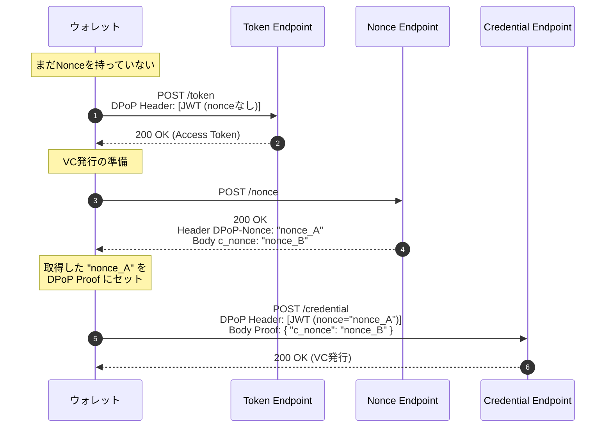

## リファレンス

DPoP本体の仕様

[RFC 9449: OAuth 2.0 Demonstrating Proof of Possession (DPoP)](https://www.rfc-editor.org/rfc/rfc9449.html)

## DPoPの仕様
### 概要
- DPoP の仕組み（フロー）
    
    DPoP は **アプリケーション層（HTTPヘッダー）** で暗号鍵の所有証明を行います。
    
    1. **鍵ペアの生成:** クライアント（アプリ）は、公開鍵と秘密鍵のペアを作成します。
    2. **トークン要求:** クライアントは認可サーバー（AS）に対し、自身の「公開鍵」を含めた「DPoP Proof（JWT形式の署名）」を送ってトークンを要求します。
    3. **トークン発行:** 認可サーバーは、その「公開鍵」と紐付いたアクセストークンを発行します（トークン内に公開鍵のハッシュ `cnf` クレームを含めるのが一般的です）。
    4. **API アクセス:** クライアントはリソースサーバー（API）へアクセスする際、以下の2つを送信します。
        - アクセストークン（Authorization ヘッダー）
        - 秘密鍵で署名した「DPoP Proof」（DPoP ヘッダー）
    5. **検証:** リソースサーバーは、「DPoP Proof の署名」と「トークンに紐付いた公開鍵」が一致するかを確認します。一致しなければ拒否します。
    
    > ポイント: もし攻撃者がアクセストークンだけを盗んでも、クライアントの「秘密鍵」を持っていなければ、正当な DPoP Proof を作成できないため、API にアクセスできません。
    > 
    - シーケンス図
        
        ```mermaid
        sequenceDiagram
            autonumber
            participant Client as クライアント<br>(App/SPA)
            participant AS as 認可サーバー<br>(Authorization Server)
            participant RS as リソースサーバー<br>(API)
        
            Note over Client: 1. 公開鍵/秘密鍵のペアを生成
        
            %% --- トークンリクエスト ---
            Note over Client: 2. DPoP Proof (JWT) を作成<br>※ヘッダーに公開鍵(jwk)を含む
        
            Client->>AS: トークンリクエスト (POST /token)<br>Header: DPoP [JWT]
        
            Note over AS: 3. DPoP Proof の署名検証<br>＆公開鍵の抽出
        
            AS->>Client: アクセストークン発行<br>token_type: DPoP
            Note left of AS: 4. トークン内に公開鍵の<br>ハッシュ(cnf)を埋め込む<br>(トークンと鍵の紐付け)
        
            %% --- リソースアクセス ---
            Note over Client: 5. APIリクエスト用の<br>新規 DPoP Proof (JWT) を作成<br>※メソッド(GET)やURIを含めて署名
        
            Client->>RS: API リクエスト (GET /resource)<br>Auth: DPoP <Access Token><br>Header: DPoP [JWT]
        
            Note over RS: 6. 検証プロセス:<br>・アクセストークンの有効性<br>・DPoP Proof の署名<br>・トークン内の鍵(cnf) == DPoPの鍵
        
            alt 検証成功
                RS->>Client: 200 OK (リソース返却)
            else 検証失敗 (鍵の不一致など)
                RS->>Client: 401 Unauthorized
            end
        ```
        
- 4. 技術的な特徴
    - **HTTP ヘッダー:** API リクエスト時に `DPoP` という HTTP ヘッダーを追加し、そこに JWT (JSON Web Token) 形式の署名を入れます。
    - **認証スキーム:** 従来の `Authorization: Bearer <token>` ではなく、`Authorization: DPoP <token>` を使用します。

### DPoP Proofの構造

RFC 9449 における **DPoP Proof** は、標準的な JWT (JSON Web Token) の形式ですが、**ヘッダー**と**ペイロード**に独自のルールがあります。

特に「どのリクエストに対する署名か」を厳密に特定するために、HTTPメソッドやURLを含める点が特徴です。

- JWTヘッダー
    
    ここには「署名に使った鍵の情報」と「トークンの種類」が入ります。
    
    ```json
    {
      "typ": "dpop+jwt",
      "alg": "ES256",
      "jwk": {
        "kty": "EC",
        "x": "l8tFrwqF...",
        "y": "9nImF...",
        "crv": "P-256"
      }
    }
    ```
    
    - **`typ` (Type):** 必須。必ず `"dpop+jwt"` という値を設定します（これにより、通常のアクセストークン等と混同されるのを防ぎます）。
    - **`alg` (Algorithm):** 必須。署名アルゴリズム（例: `ES256`, `RS256`, `EdDSA` など）。非対称鍵である必要があります（`HS256` などの共通鍵は不可）。
    - **`jwk` (JSON Web Key):** 必須。**クライアントの公開鍵**そのものを埋め込みます。認可サーバーやAPIサーバーは、この鍵を使って署名を検証します。
- JWTペイロード
    
    ここには「リクエストの内容」と「一意性」を保証する情報が入ります。
    
    ```json
    {
      "jti": "-BwC3ESc6acc2l4",
      "htm": "GET",
      "htu": "https://api.example.com/resource/123",
      "iat": 1615910532,
      "ath": "fUHyO2r...",
      "nonce": "abc123xyz"
    }
    ```
    
    **各クレームの詳細**
    
    | **クレーム** | **名称** | **必須** | **説明** |
    | --- | --- | --- | --- |
    | **`jti`** | JWT ID | **Yes** | **一意な識別子**。リプレイ攻撃（再送）を防ぐため、サーバー側で過去のIDと重複していないかチェックされます。十分なエントロピーを持つランダムな文字列にします。 |
    | **`htm`** | HTTP Method | **Yes** | **HTTPメソッド**。リクエストのメソッド（`POST`, `GET`, `PUT` など）と一致している必要があります。 |
    | **`htu`** | HTTP URI | **Yes** | **リクエスト先のURL**。クエリパラメータやフラグメント（`?foo=bar` や `#section`）を除いた、正規化されたURLを指定します。 |
    | **`iat`** | Issued At | **Yes** | **発行時刻**（UNIXタイムスタンプ）。サーバーはこの時刻が「現在時刻」と近いか（古すぎないか、未来すぎないか）を確認します。 |
    | **`ath`** | Access Token Hash | **条件付** | **アクセストークンのハッシュ値**。API（リソースサーバー）にアクセスする際は**必須**です。トークンエンドポイントへのリクエスト時は不要です。 |
    | **`nonce`** | Nonce | **条件付** | **サーバーから提供されたナンス**。サーバーがNonceを要求する場合のみ必須です。 |

- 利用シーンによる違い
    
    DPoP Proof は2つの場面で使われますが、ペイロードの中身（特に `ath`）が少し異なります。
    
    **A. トークンエンドポイントへのリクエスト（トークン発行時）**
    
    まだアクセストークンを持っていないため、`ath` は含めません。
    
    ```json
    {
      "jti": "4B8fc...",
      "htm": "POST",
      "htu": "https://server.example.com/token",
      "iat": 1562262616
    }
    ```
    
    **B. リソースサーバーへのアクセス（API利用時）**
    
    持っているアクセストークンとDPoP Proofを紐付けるため、**`ath` が必須**になります。

### athクレームの詳細

> [**4.2. DPoP Proof JWT Syntax**](https://www.rfc-editor.org/rfc/rfc9449.html#name-dpop-proof-jwt-syntax)
> 

> `ath`: Hash of the access token. The value **MUST** be the result of a base64url encoding (as defined in [Section 2](https://rfc-editor.org/rfc/rfc7515#section-2) of [[RFC7515](https://www.rfc-editor.org/rfc/rfc9449.html#RFC7515)]) the SHA-256 [[SHS](https://www.rfc-editor.org/rfc/rfc9449.html#SHS)] hash of the ASCII encoding of the associated access token's value.
> 

- 計算ロジック
    
    `ath` (Access Token Hash) の計算ロジックは、RFC 9449 で以下のように定義されています。
    
    > アクセストークンの ASCII 文字列に対して SHA-256 ハッシュを取り、それを Base64URL エンコード（パディングなし）したもの
    > 
    
    数式で書くと以下のようになります。
    
    $$ath = text{Base64URL}(text{SHA256}(text{access_token}))$$
    
    **計算の3ステップ**
    
    1. **文字列変換:** アクセストークンを ASCII（バイト列）として扱います。
    2. **ハッシュ化:** **SHA-256** アルゴリズムでハッシュ値を計算します。
    3. **エンコード:** 結果のバイト列を **Base64URL** 形式で文字列化します。
        - **重要:** 末尾のパディング（`=`）は削除します。
    
    **検証用データ (RFC 9449 Example)**
    
    実装が正しいか確認したい場合は、以下の値でテストしてください。
    
    - **Access Token:** `Kz~8mXK1EalYznwH-LC6`
    - **正解 `ath`:** `fUHyO2r2Hz3CZlmIz3E_IBzZ6l2C3-c_IV4t9_I7v0Q`
    
    もし末尾に `=` がついていたり、`+` や `/` が含まれている場合は、エンコード方式が間違っています（通常のBase64になっている可能性が高いです）。
    
- 実装例
    - JavaScript (ブラウザ / Web API)
        
        SPAなどでブラウザ上で計算する場合、`Web Crypto API` を使用します（非同期処理になります）。
        
        ```jsx
        async function calculateAth(accessToken) {
          const encoder = new TextEncoder();
          const data = encoder.encode(accessToken);
          
          // 1. SHA-256 ハッシュ計算
          const hashBuffer = await crypto.subtle.digest('SHA-256', data);
          
          // 2. Base64URL エンコードへの変換
          const hashArray = Array.from(new Uint8Array(hashBuffer));
          const hashBase64 = btoa(String.fromCharCode.apply(null, hashArray));
          
          // Base64URL形式へ置換
          const ath = hashBase64
            .replace(/\+/g, '-')
            .replace(/\//g, '_')
            .replace(/=+$/, '');
            
          return ath;
        }
        ```

## OID4VCI拡張

### HAIPより抜粋

> • Sender-constrained access token: MUST support DPoP as defined in [[RFC9449](https://openid.net/specs/openid4vc-high-assurance-interoperability-profile-1_0-05.html#RFC9449)]. Note that this requires Wallets to be prepared to handle the `DPoP-Nonce` HTTP response header from the Credential Issuer's Nonce Endpoint, as well as from other applicable endpoints of the Credential Issuer and Authorization Server.
> 

https://openid.net/specs/openid4vc-high-assurance-interoperability-profile-1_0-05.html#section-4

### VCIの[**7.2.](https://openid.net/specs/openid-4-verifiable-credential-issuance-1_0.html#section-7.2) [Nonce Response](https://openid.net/specs/openid-4-verifiable-credential-issuance-1_0.html#name-nonce-response)**より抜粋

> The Credential Issuer MAY provide a DPoP nonce in an HTTP header as defined in Section 8.2 of [[RFC9449](https://openid.net/specs/openid-4-verifiable-credential-issuance-1_0.html#RFC9449)]. In this case, the Wallet uses the new nonce value in the DPoP proof when presenting an access token at the Credential Endpoint.
> 
> 
> Below is a non-normative example of a Nonce Response:
> 
> ```
> HTTP/1.1 200 OK
> Content-Type: application/json
> Cache-Control: no-store
> DPoP-Nonce: eyJ7S_zG.eyJH0-Z.HX4w-7v
> 
> {
>   "c_nonce": "wKI4LT17ac15ES9bw8ac4"
> }
> ```
> 

https://openid.net/specs/openid-4-verifiable-credential-issuance-1_0.html#section-7.2

---

### 統合フロー

