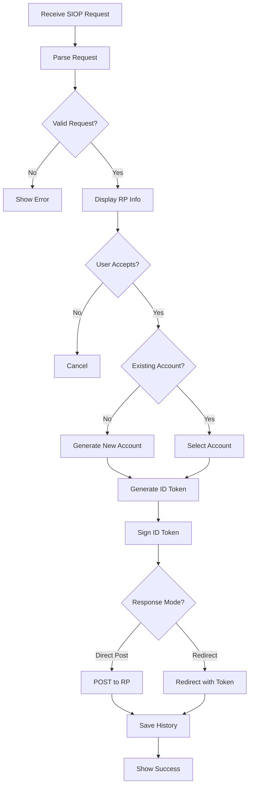

# Authentication (SIOPv2)

## Status
- [x] Draft
- [ ] Review
- [ ] Approved
- [x] Implemented
- [ ] Verified

## Overview

SIOPv2 (Self-Issued OpenID Provider v2) プロトコルを使用した、分散型アイデンティティ認証機能です。

## User Stories

- As a user, I want to authenticate to relying parties using my self-issued identity
- As a user, I want to manage multiple pairwise accounts for different services
- As a user, I want to export/import my accounts between devices
- As a user, I want to see my authentication history

## Requirements

### Functional Requirements

1. **SIOP Request Handling**
   - `openid://` スキームのサポート
   - Request URIからのJWT取得
   - リクエストの検証

2. **Pairwise Account Management**
   - Pairwise Accountの生成
   - 既存Accountの選択
   - RP別識別子対応

3. **ID Token Generation**
   - Self-issued ID Tokenの生成
   - 署名の実施
   - Claimsの構築

4. **Response Submission**
   - Direct Post対応
   - Redirectフロー対応

5. **Account Backup & Restore**
   - Mnemonicベースのアカウントエクスポート
   - アカウントインポート（Backup/Restore機能）
   - アカウント情報の管理

### Non-Functional Requirements

1. **Security**
   - 秘密鍵のセキュア管理
   - ID Tokenの適切な署名
   - リプレイ攻撃対策

2. **Privacy**
   - Pairwise識別子によるトラッキング防止
   - 最小限の情報開示

3. **Usability**
   - シンプルな認証フロー
   - わかりやすいRP情報表示

## Design

### UI/UX Design

#### Screens

1. **RP Information Screen**
   - RP名
   - 要求されるClaims
   - Accept/Declineボタン

2. **Account Selection Screen** (複数Account存在時)
   - 既存Accounts リスト
   - "Create New Account" オプション

3. **Processing Screen**
   - ID Token生成中
   - ローディングインジケーター

4. **Success Screen**
   - 認証成功メッセージ
   - Redirectオプション

### Data Flow



## Implementation Plan

- [x] SIOP Request解析
- [x] Request URI取得
- [x] Pairwise Account生成（HDKeyRing）
- [x] ID Token生成
- [x] Direct Post実装
- [x] ID Token署名
- [x] 認証履歴保存
- [ ] 複数Account管理UI
- [x] アカウントエクスポート/インポート（Backup/Restore機能として実装済み）
- [ ] DIDメソッド対応（did:key, did:web等）（将来）

## API Overview

```swift
// メイン認証フロー
class OpenIdProvider {
    func processAuthRequest(_ url: String) async
        -> Result<ProcessedRequestData, AuthorizationRequestError>

    func respondToken(credentials: [SubmissionCredential]?) async
        -> Result<TokenSendResult, Error>

    private func createSiopIdToken()
        -> Result<([String: String], String), Error>
}

struct ProcessedRequestData {
    var authorizationRequest: AuthorizationRequestPayload
    var requestObjectJwt: String
    var requestObject: RequestObjectPayload?
    var clientMetadata: RPRegistrationMetadataPayload
    var presentationDefinition: PresentationDefinition?
    var requestIsSigned: Bool
}

// Pairwise Account管理
class PairwiseAccount {
    func getAccount(rp: String, index: Int = -1) -> Account?
    func nextAccount() -> Account
    func indexToAccount(index: Int, rp: String? = nil) -> Account
    func getPrivateKey(index: Int) -> Data
    func getPublicKey(index: Int) -> (Data, Data)
}

struct Account {
    let index: Int
    let publicJwk: ECPublicJwk
    let privateJwk: ECJwk
    let thumbprint: String
    var rp: String?
}
```

## Data Model

**Protocol Buffers**: `id_token_sharing_history.proto`

```proto
message IdTokenSharingHistory {
  string rp = 1;
  int32 accountIndex = 2;
  google.protobuf.Timestamp createdAt = 3;
}
```

**Swift Model**: `tw2023_wallet/Models/IdTokenSharingHistory.swift`

```swift
struct IdTokenSharingHistory: Codable, Hashable, History {
    let rp: String
    let accountIndex: Int
    let createdAt: String
}
```

**CoreData Entity**: `IdTokenSharingHistoryEntity`
- `rp`: String
- `accountIndex`: Int32
- `createdAt`: Date

## Security Considerations

### Threats

1. **Account Spoofing**
   - Mitigation: 署名検証、JWK Thumbprintによる識別

2. **ID Token Replay**
   - Mitigation: Nonce、有効期限、ワンタイムトークン

3. **Key Compromise**
   - Mitigation: HDKeyRingによる鍵派生、Keychain保存、Key Rotation

### Security Checklist

- [x] ID Token署名
- [x] Nonce検証
- [x] 秘密鍵のKeychain保存
- [x] HTTPS通信
- [ ] Key Rotation機能

## Testing Strategy

### Unit Tests

- SIOP Request解析
- Pairwise Account生成
- ID Token生成
- 署名検証

### Integration Tests

- End-to-end認証フロー
- 実際のRPとの連携

## Performance Metrics

- Request解析: < 1秒
- Account生成: < 2秒
- ID Token生成: < 1秒
- 全体フロー: < 5秒

## References

- [SIOPv2 Specification](https://openid.net/specs/openid-connect-self-issued-v2-1_0-13.html)
- Implementation: `tw2023_wallet/Services/OID/Provider/`
