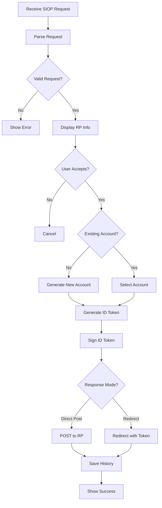

# Authentication - Design

## UI/UX Design

### Screens

1. **RP Information Screen**
   - RP名
   - 要求されるClaims
   - Accept/Declineボタン

2. **Account Selection Screen** (複数Account存在時)
   - 既存Accounts リスト
   - "Create New Account" オプション

3. **Processing Screen**
   - ID Token生成中
   - ローディングインジケーター

4. **Success Screen**
   - 認証成功メッセージ
   - Redirectオプション

## Data Flow



## Pairwise Account Flow

```
新規RP認証
    ↓
HDKeyRingから新しいAccountを派生
    ↓
Account IndexをRPに紐付けて保存
    ↓
ID Token生成・署名
    ↓
RPへ送信
```

```
既存RP再認証
    ↓
RPに紐付いたAccount Indexを取得
    ↓
対応するAccountで ID Token生成
    ↓
RPへ送信
```

## Privacy by Design

Pairwise識別子を使用することで、異なるRP間でのユーザートラッキングを防止します。

| RP | Account Index | Subject Identifier |
|----|---------------|-------------------|
| example.com | 0 | did:key:z6Mk... |
| another.org | 1 | did:key:z6Mn... |
| service.io | 2 | did:key:z6Mo... |

各RPは異なる識別子を受け取るため、RP間でのユーザー名寄せが困難になります。
