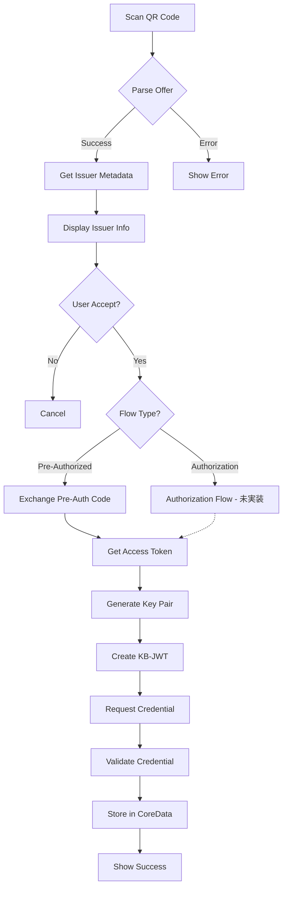

# Credential Issuance (OID4VCI)

## Status
- [x] Draft
- [ ] Review
- [ ] Approved
- [x] Implemented
- [ ] Verified

## Overview

OID4VCI (OpenID for Verifiable Credential Issuance) プロトコルを使用して、Issuerからデジタルクレデンシャルを受け取る機能です。

**現在の実装状況**:
- ✅ Pre-Authorized Code Flow (実装済み)
- ⏳ Authorization Code Flow (将来対応予定)

## User Stories

- As a user, I want to scan a QR code to receive a credential from an issuer
- As a user, I want to see the issuer's information before accepting a credential
- As a user, I want to securely store the issued credential in my wallet
- As a user, I want to see my issued credentials in the wallet

## Requirements

### Functional Requirements

1. **QR Code Scanning**
   - ユーザーがQRコードをスキャンできる
   - Credential Offerを解析できる
   - Deep Linkからの起動に対応

2. **Issuer Metadata Retrieval**
   - Issuerのメタデータを`.well-known`エンドポイントから取得
   - Issuerの情報を表示（名前、ロゴ、信頼性情報）

3. **Authorization Flow**
   - Pre-Authorized Code Flow対応（実装済み）
   - Authorization Code Flow対応（将来予定）

4. **Credential Request**
   - Access Tokenの取得
   - Key Binding JWT (KB-JWT)の生成
   - Credentialリクエストの送信

5. **Credential Storage**
   - 受信したCredentialの検証
   - CoreDataへの保存
   - Protocol Buffersでのシリアライゼーション

### Non-Functional Requirements

1. **Security**
   - すべての通信はHTTPS
   - 秘密鍵はKeychain/Secure Enclaveに保存
   - Credentialの署名検証

2. **Performance**
   - QRコードスキャン: 1秒以内
   - Credential発行: 10秒以内

3. **Usability**
   - わかりやすいエラーメッセージ
   - 発行プロセスの進捗表示
   - キャンセル可能

4. **Reliability**
   - ネットワークエラー時の適切なハンドリング
   - リトライメカニズム

## Design

### UI/UX Design

#### Screens

1. **QR Scanner Screen**
   - カメラビュー
   - スキャンガイド
   - キャンセルボタン

2. **Issuer Information Screen**
   - Issuer名
   - Issuerロゴ
   - Credential種類
   - 発行されるデータの説明
   - Accept/Declineボタン

3. **Processing Screen**
   - ローディングインジケーター
   - 現在の処理ステップ表示
   - キャンセルボタン

4. **Success Screen**
   - 成功メッセージ
   - 発行されたCredentialのプレビュー
   - "View Credential" ボタン
   - "Done" ボタン

5. **Error Screen**
   - エラーメッセージ
   - 詳細（開発者向け）
   - Retryボタン
   - Closeボタン

### Data Flow

**注**: 現在はPre-Authorized Code Flowのみ実装済み。Authorization Code Flowは将来対応予定。



### Sequence Diagram

詳細なシーケンス図は将来追加予定。

## Implementation Plan

- [x] QR Code Scanner実装
- [x] Credential Offer解析
- [x] Issuer Metadata取得
- [x] Pre-Authorized Code Flow実装
- [ ] Authorization Code Flow実装（将来）
- [x] KB-JWT生成
- [x] Credential Request実装
- [x] Credential検証
- [x] CoreData保存
- [ ] UI/UX改善
- [ ] エラーハンドリング強化

## API Overview

### VCI Client

**Note**: 現在はPre-Authorized Code Flowのみサポート。`issueToken()`はPre-Authorized Code Grantを使用。

```swift
// tw2023_wallet/Services/OID/VCI/VCIClient.swift
class VCIClient {
    private var metadata: Metadata
    private var tokenEndpoint: URL
    private var credentialEndpoint: URL
    private(set) var credentialOffer: CredentialOffer

    init(credentialOffer: CredentialOffer, metaData: Metadata) async throws

    // Pre-Authorized Code Flow用
    func issueToken(txCode: String?, using session: URLSession = URLSession.shared) async throws
        -> OAuthTokenResponse

    func issueCredential(
        payload: any CredentialRequest,
        accessToken: String,
        using session: URLSession = URLSession.shared
    ) async throws -> CredentialResponse
}
```

### Data Models

```swift
// Credential Offer
struct CredentialOffer: Codable {
    let credentialIssuer: String
    let credentialConfigurationIds: [String]
    let grants: Grant?

    static func fromString(_ credentialOffer: String) -> CredentialOffer?
}

struct Grant: Codable {
    let authorizationCode: GrantAuthorizationCode?
    let preAuthorizedCode: GrantPreAuthorizedCode?
}

struct GrantPreAuthorizedCode: Codable {
    let preAuthorizedCode: String
    let txCode: TxCode?
    var interval: Int? = 5
    let authorizationServer: String?
}

// Issuer Metadata
struct CredentialIssuerMetadata: Codable {
    let credentialIssuer: String
    let authorizationServers: [String]?
    let credentialEndpoint: String
    let batchCredentialEndpoint: String?
    let deferredCredentialEndpoint: String?
    let notificationEndpoint: String?
    let display: [IssuerDisplay]?
    let credentialConfigurationsSupported: [String: CredentialConfiguration]
}
```

## Data Model

### Protocol Buffers

**File**: `tw2023_wallet/proto/credential_data.proto`

```proto
message CredentialData {
  string id = 1;
  string format = 2;
  string credential = 3;
  string cNonce = 4;
  int32 cNonceExpiresIn = 5;
  string iss = 6;
  int64 iat = 7;
  int64 exp = 8;
  string type = 9;
  string accessToken = 10;
  string credentialIssuerMetadata = 11;
}
```

### CoreData Entity

**Entity**: `CredentialDataEntity`

- `id`: String
- `format`: String ("jwt_vc_json", "vc+sd-jwt", etc.)
- `credential`: String (JWT文字列またはSD-JWT)
- `cNonce`: String (OID4VCI c_nonce)
- `cNonceExpiresIn`: String
- `iss`: String (Issuer identifier)
- `iat`: String (発行日時)
- `exp`: String (有効期限)
- `type`: String (Credential type)
- `accessToken`: String (OID4VCI access token)
- `credentialIssuerMetadata`: String (JSON形式のメタデータ)

### Data Manager

```swift
// tw2023_wallet/datastore/CredentialDataManager.swift
class CredentialDataManager {
    func saveCredential(credentialData: Datastore_CredentialData)
    func getCredential(id: String) -> Datastore_CredentialData?
    func getAllCredentials() -> [Datastore_CredentialData]
    func deleteCredential(id: String)
}
```

## Security Considerations

### Threats

1. **Man-in-the-Middle Attack**
   - Mitigation: HTTPS強制、Certificate Pinning（将来）

2. **Credential Injection**
   - Mitigation: Issuer署名検証、Metadata検証

3. **Replay Attack**
   - Mitigation: Nonce使用、タイムスタンプ検証

4. **Key Compromise**
   - Mitigation: Secure Enclave使用、Key Rotation

### Security Checklist

- [x] すべてのHTTP通信がHTTPS
- [x] Issuer署名の検証
- [x] 秘密鍵のKeychain保存
- [ ] Certificate Pinning
- [x] KB-JWTのNonce検証
- [x] Credential有効期限チェック

## Testing Strategy

### Unit Tests

```swift
class CredentialIssuanceTests: XCTestCase {
    func testParseValidOffer() async throws {
        // Test credential offer parsing
    }

    func testParseInvalidOffer() async throws {
        // Test error handling
    }

    func testGetIssuerMetadata() async throws {
        // Test metadata retrieval
    }

    func testGenerateKBJWT() throws {
        // Test KB-JWT generation
    }
}
```

### Integration Tests

- End-to-end発行フローテスト
- 実際のIssuerとの連携テスト（テスト環境）

### UI Tests

- QRコードスキャンフロー
- エラーハンドリング
- キャンセルフロー

## Error Handling

### Error Types

```swift
enum CredentialIssuanceError: Error {
    case invalidOffer(String)
    case networkError(Error)
    case invalidMetadata(String)
    case authorizationFailed(String)
    case credentialRequestFailed(String)
    case invalidCredential(String)
    case storageFailed(Error)
}
```

### User-Facing Messages

| Error | User Message |
|-------|--------------|
| invalidOffer | "Invalid QR code. Please scan a valid credential offer." |
| networkError | "Network error. Please check your connection and try again." |
| authorizationFailed | "Authorization failed. Please try again." |
| credentialRequestFailed | "Failed to receive credential. Please contact the issuer." |
| invalidCredential | "Received credential is invalid." |
| storageFailed | "Failed to save credential. Please try again." |

## Performance Metrics

- QR Code scan to display: < 1 second
- Metadata retrieval: < 2 seconds
- Token exchange: < 3 seconds
- Credential issuance: < 5 seconds
- Total flow: < 10 seconds

## Accessibility

- VoiceOver対応
- Dynamic Type対応
- カラーコントラスト確保
- キーボードナビゲーション

## Localization

- 英語
- 日本語
- その他（将来）

## Analytics & Monitoring

### Events to Track

- `credential_issuance_started`
- `credential_issuance_completed`
- `credential_issuance_failed`
- `qr_scan_success`
- `qr_scan_failed`

### Metrics

- 発行成功率
- 平均発行時間
- エラー発生率（種類別）

## Known Issues

1. Authorization Code Flowが未実装
2. バッチ発行（複数Credential同時発行）未対応
3. Deferred Credential未対応

## Future Enhancements

1. Authorization Code Flow実装
2. バッチCredential発行対応
3. Deferred Credential対応
4. オフライン発行（将来の標準化後）
5. Credential更新機能

## References

- [OID4VCI 1.0 Final Specification](https://openid.net/specs/openid-4-verifiable-credential-issuance-1_0.html)
- [ADR: OID4VCI 1.0 Upgrade](../../docs/adr/0001-upgrade-oid4vci-to-version-1.0.md)
- Implementation: `tw2023_wallet/Services/OID/VCI/`
- Data Manager: `tw2023_wallet/datastore/CredentialDataManager.swift`
- Protocol Buffers: `tw2023_wallet/proto/credential_data.proto`
