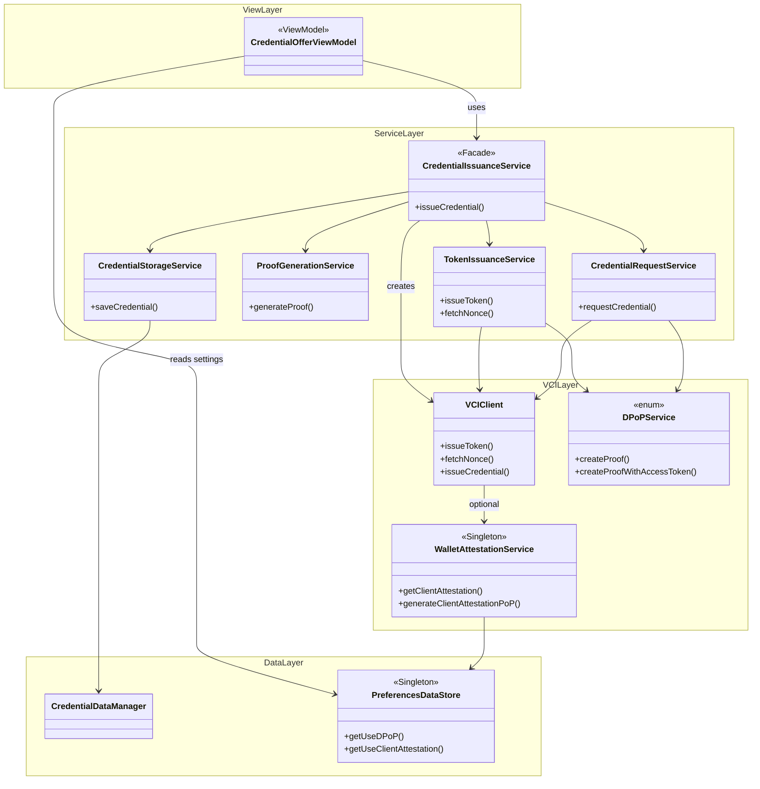
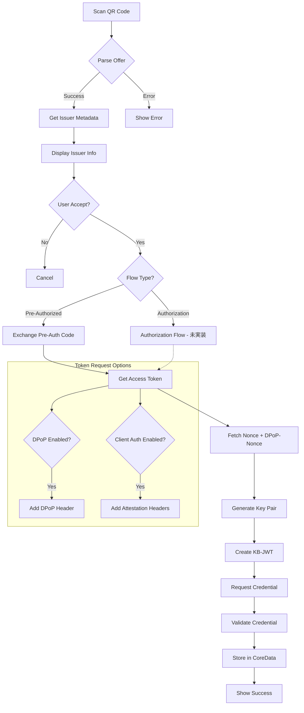
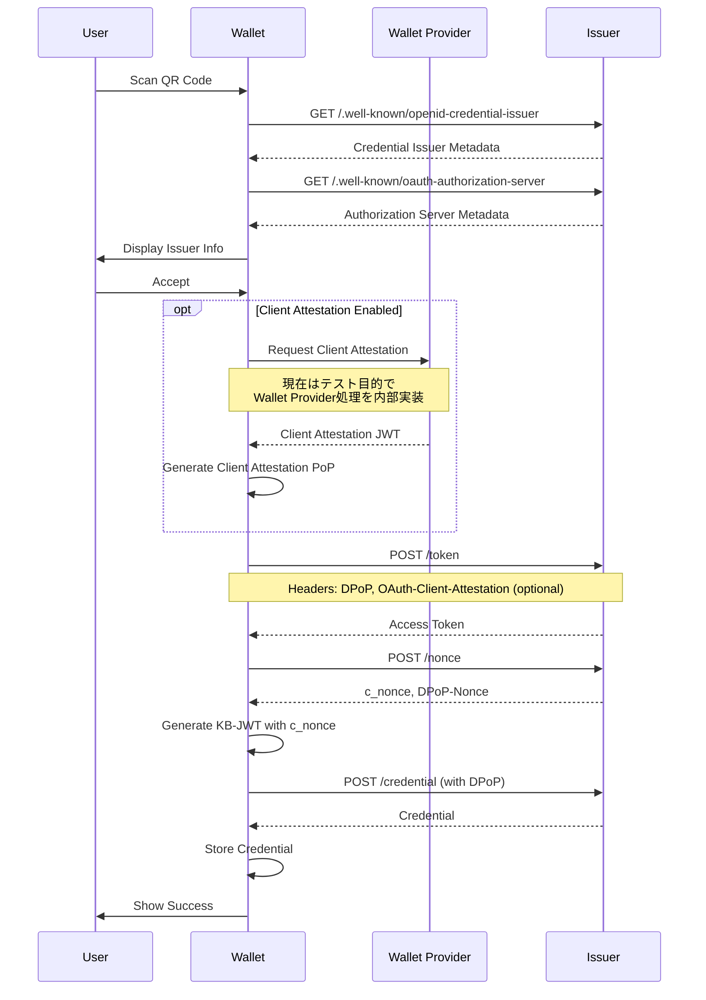

# Credential Issuance - Design

## UI/UX Design

### Screens

1. **QR Scanner Screen**
   - カメラビュー
   - スキャンガイド
   - キャンセルボタン

2. **Issuer Information Screen**
   - Issuer名
   - Issuerロゴ
   - Credential種類
   - 発行されるデータの説明
   - Accept/Declineボタン

3. **Processing Screen**
   - ローディングインジケーター
   - 現在の処理ステップ表示
   - キャンセルボタン

4. **Success Screen**
   - 成功メッセージ
   - 発行されたCredentialのプレビュー
   - "View Credential" ボタン
   - "Done" ボタン

5. **Error Screen**
   - エラーメッセージ
   - 詳細（開発者向け）
   - Retryボタン
   - Closeボタン

## Class Diagram



## Layer Architecture

| レイヤー | 責務 |
|---------|------|
| View Layer | UI表示、ユーザー操作処理 |
| Service Layer (Facade) | 発行フロー全体のオーケストレーション |
| Service Layer (Individual) | 個別機能（トークン発行、Proof生成、リクエスト、保存） |
| VCI Layer | OID4VCI プロトコル通信、DPoP Proof生成、Client Attestation |
| Data Layer | CoreDataへの永続化、UserDefaultsへの設定保存 |

## Settings

設定画面から以下のオプションを制御可能：

| 設定 | 説明 | デフォルト |
|------|------|-----------|
| Use DPoP | DPoP (RFC 9449) によるSender-Constrained Token | ON |
| Use Client Authentication | OAuth 2.0 Attestation-Based Client Authentication | OFF |
| Require Server Authentication | 署名付きメタデータを要求 | OFF |
| Use Trust List | トラストリストによる証明書検証 | ON |

## Data Flow

**注**: 現在はPre-Authorized Code Flowのみ実装済み。Authorization Code Flowは将来対応予定。



## Token Request Authentication

トークンリクエストでは、設定に応じて以下の認証方式を使用：

### DPoP (RFC 9449)
- 設定: `Use DPoP`
- HTTPヘッダー: `DPoP: <dpop-proof-jwt>`
- Sender-Constrained Tokenを実現

### Client Attestation (OAuth 2.0 Attestation-Based Client Authentication)
- 設定: `Use Client Authentication`
- HTTPヘッダー:
  - `OAuth-Client-Attestation: <client-attestation-jwt>`
  - `OAuth-Client-Attestation-PoP: <client-attestation-pop-jwt>`

#### Client Attestation JWT構造
```
Header:
  typ: oauth-client-attestation+jwt
  alg: ES256
  x5c: [certificate-chain]

Payload:
  iss: <wallet-provider-identifier>
  sub: <client-id>
  exp: <expiration>
  nbf: <not-before>
  cnf: { jwk: <wallet-public-key> }
  wallet_name: "OWND Wallet"
  wallet_link: <url>
```

#### Client Attestation PoP JWT構造
```
Header:
  typ: oauth-client-attestation-pop+jwt
  alg: ES256

Payload:
  iss: <client-id>
  aud: <authorization-server-issuer>
  jti: <unique-identifier>
  iat: <issued-at>
```

### 関連仕様
- [OID4VCI Appendix E - Wallet Attestations](https://openid.net/specs/openid-4-verifiable-credential-issuance-1_0.html#appendix-E)
- [OAuth 2.0 Attestation-Based Client Authentication](https://drafts.oauth.net/draft-ietf-oauth-attestation-based-client-auth/draft-ietf-oauth-attestation-based-client-auth.html)
- [HAIP 4.4.1 - Wallet Attestation](https://openid.net/specs/openid4vc-high-assurance-interoperability-profile-1_0-05.html#name-wallet-attestation)

## Sequence Diagram



## Accessibility

- VoiceOver対応
- Dynamic Type対応
- カラーコントラスト確保
- キーボードナビゲーション

## Localization

- 英語
- 日本語
- その他（将来）
