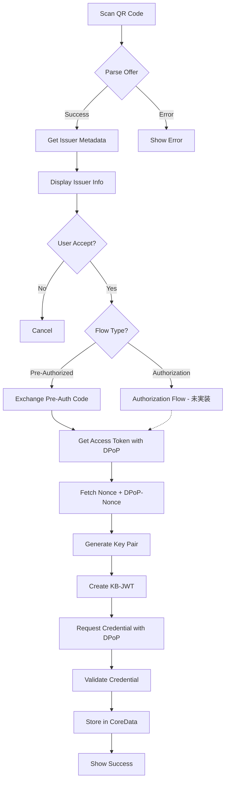

# Credential Issuance - Design

## UI/UX Design

### Screens

1. **QR Scanner Screen**
   - カメラビュー
   - スキャンガイド
   - キャンセルボタン

2. **Issuer Information Screen**
   - Issuer名
   - Issuerロゴ
   - Credential種類
   - 発行されるデータの説明
   - Accept/Declineボタン

3. **Processing Screen**
   - ローディングインジケーター
   - 現在の処理ステップ表示
   - キャンセルボタン

4. **Success Screen**
   - 成功メッセージ
   - 発行されたCredentialのプレビュー
   - "View Credential" ボタン
   - "Done" ボタン

5. **Error Screen**
   - エラーメッセージ
   - 詳細（開発者向け）
   - Retryボタン
   - Closeボタン

## Class Diagram

```mermaid
classDiagram
    %% View Layer
    class CredentialOfferViewModel {
        <<ViewModel>>
    }

    %% Service Layer - Protocols
    class CredentialIssuanceServiceProtocol {
        <<protocol>>
    }
    class TokenIssuanceServiceProtocol {
        <<protocol>>
    }
    class ProofGenerationServiceProtocol {
        <<protocol>>
    }
    class CredentialRequestServiceProtocol {
        <<protocol>>
    }
    class CredentialStorageServiceProtocol {
        <<protocol>>
    }

    %% Service Layer - Implementations
    class CredentialIssuanceService {
        <<Facade>>
    }
    class TokenIssuanceService
    class ProofGenerationService
    class CredentialRequestService
    class CredentialStorageService

    %% VCI Layer
    class VCIClient
    class DPoPService {
        <<enum>>
    }

    %% Data Layer
    class CredentialDataManager

    %% Relationships
    CredentialOfferViewModel --> CredentialIssuanceServiceProtocol : uses

    CredentialIssuanceService ..|> CredentialIssuanceServiceProtocol : implements
    TokenIssuanceService ..|> TokenIssuanceServiceProtocol : implements
    ProofGenerationService ..|> ProofGenerationServiceProtocol : implements
    CredentialRequestService ..|> CredentialRequestServiceProtocol : implements
    CredentialStorageService ..|> CredentialStorageServiceProtocol : implements

    CredentialIssuanceService --> TokenIssuanceServiceProtocol : uses
    CredentialIssuanceService --> ProofGenerationServiceProtocol : uses
    CredentialIssuanceService --> CredentialRequestServiceProtocol : uses
    CredentialIssuanceService --> CredentialStorageServiceProtocol : uses
    CredentialIssuanceService --> VCIClient : creates

    TokenIssuanceService --> VCIClient : uses
    TokenIssuanceService --> DPoPService : uses
    CredentialRequestService --> VCIClient : uses
    CredentialRequestService --> DPoPService : uses
    CredentialStorageService --> CredentialDataManager : uses
```

## Layer Architecture

| レイヤー | 責務 |
|---------|------|
| View Layer | UI表示、ユーザー操作処理 |
| Service Layer (Facade) | 発行フロー全体のオーケストレーション |
| Service Layer (Individual) | 個別機能（トークン発行、Proof生成、リクエスト、保存） |
| VCI Layer | OID4VCI プロトコル通信、DPoP Proof生成 |
| Data Layer | CoreDataへの永続化 |

## Data Flow

**注**: 現在はPre-Authorized Code Flowのみ実装済み。Authorization Code Flowは将来対応予定。

## Sequence Diagram

詳細なシーケンス図は将来追加予定。

## Accessibility

- VoiceOver対応
- Dynamic Type対応
- カラーコントラスト確保
- キーボードナビゲーション

## Localization

- 英語
- 日本語
- その他（将来）
