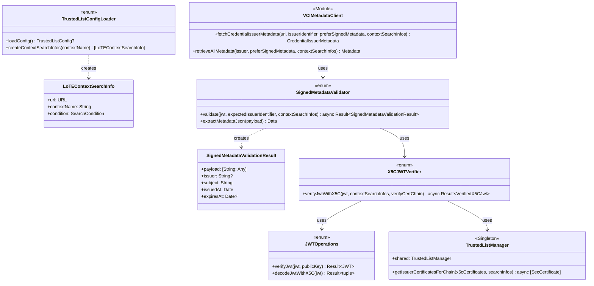
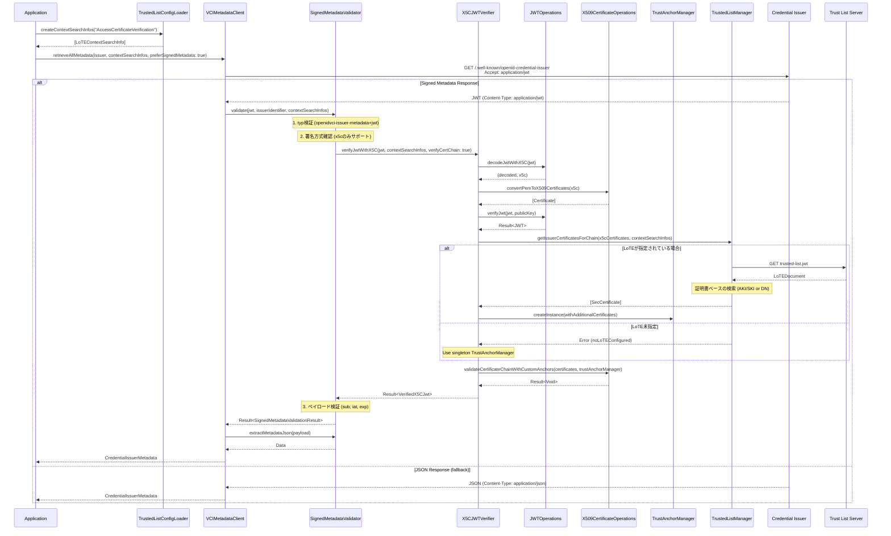

# Credential Issuance - Metadata Verification

## Overview

OID4VCI 1.0 Section 12.2.2/12.2.3に準拠したメタデータの取得と検証機能を提供します。Issuerメタデータの信頼性を検証するため、署名付きメタデータ(Signed Metadata)に対応しています。

トラストリストと証明書チェーン検証の詳細は [サーバー認証](../server-authentication/README.md) を参照してください。

### 主な機能

| 機能 | 説明 | 仕様 |
|------|------|------|
| Signed Metadata | 署名付きメタデータの検証 | OID4VCI 1.0 Section 12.2.3 |
| Accept Header制御 | 署名付き/JSONメタデータの選択 | OID4VCI 1.0 Section 12.2.2 |

### 対応状況

- ✅ 署名方式: x5c (証明書チェーン)
- ⏳ 署名方式: kid (未サポート)
- ⏳ 署名方式: trust_chain (未サポート)

## Class Diagram



> **Note**: TrustedListManager, X5CJWTVerifier, TrustAnchorManager, X509CertificateOperations の詳細は [サーバー認証](../server-authentication/README.md) を参照してください。

## Sequence Diagram

### メタデータ取得フロー (Signed Metadata)



> **Note**: TrustedListManager内部処理フローと証明書チェーン検証フローの詳細は [サーバー認証](../server-authentication/README.md) を参照してください。

## API Reference

### VCIMetadataClient

メタデータ取得のエントリポイント。

```swift
// tw2023_wallet/Services/OID/VCI/VCIMetadataClient.swift

/// Credential Issuerメタデータを取得
/// - Parameters:
///   - url: メタデータエンドポイントURL
///   - issuerIdentifier: Credential Issuer識別子 (sub検証用)
///   - preferSignedMetadata: true=署名付き(application/jwt), false=JSON(application/json)
///   - contextSearchInfos: 検索対象のLoTEコンテキスト情報配列
/// - Returns: CredentialIssuerMetadata
func fetchCredentialIssuerMetadata(
    from url: URL,
    issuerIdentifier: String,
    preferSignedMetadata: Bool = false,
    contextSearchInfos: [LoTEContextSearchInfo] = [],
    using session: URLSession = URLSession.shared
) async throws -> CredentialIssuerMetadata

/// すべてのメタデータ (Issuer + Authorization Server) を取得
func retrieveAllMetadata(
    issuer: String,
    preferSignedMetadata: Bool = false,
    contextSearchInfos: [LoTEContextSearchInfo] = [],
    using session: URLSession = URLSession.shared
) async throws -> Metadata
```

### SignedMetadataValidator

署名付きメタデータの検証。

```swift
// tw2023_wallet/Services/OID/VCI/SignedMetadataValidator.swift

enum SignedMetadataValidator {
    /// 署名付きメタデータを検証 (TrustedList対応)
    /// - Parameters:
    ///   - jwt: 署名付きメタデータJWT
    ///   - expectedIssuerIdentifier: 期待するCredential Issuer識別子
    ///   - contextSearchInfos: 検索対象のLoTEコンテキスト情報配列
    static func validate(
        jwt: String,
        expectedIssuerIdentifier: String,
        contextSearchInfos: [LoTEContextSearchInfo] = []
    ) async -> Result<SignedMetadataValidationResult, SignedMetadataError>

    /// ペイロードからメタデータJSONを抽出
    static func extractMetadataJson(from payload: [String: Any]) throws -> Data
}

/// 検証結果
struct SignedMetadataValidationResult {
    let payload: [String: Any]
    let issuer: String?      // iss (OPTIONAL)
    let subject: String      // sub (REQUIRED) = Credential Issuer識別子
    let issuedAt: Date       // iat (REQUIRED)
    let expiresAt: Date?     // exp (OPTIONAL)
}
```

### JWTOperations

純粋なJWT操作（署名、検証、デコード）を提供。

```swift
// tw2023_wallet/Signature/JWT.swift

enum JWTOperations {
    /// JWTに署名
    static func sign(
        keyAlias: String,
        header: [String: Any],
        payload: [String: Any]
    ) -> Result<String, SignatureError>

    /// 公開鍵でJWT署名を検証
    static func verifyJwt(
        jwt: String,
        publicKey: SecKey
    ) -> Result<JWT, JWTVerificationError>

    /// JWTをデコード
    static func decodeJwt(jwt: String) throws -> ([String: Any], [String: Any], String?)

    /// JWTをデコードしてx5cヘッダーを抽出
    static func decodeJwtWithX5C(
        jwt: String
    ) -> Result<(decoded: JWT, x5c: [String]), JWTVerificationError>

    /// JWTをデコードしてx5uヘッダーを抽出
    static func decodeJwtWithX5U(
        jwt: String
    ) -> Result<(decoded: JWT, x5uUrl: String), JWTVerificationError>
}
```

## Error Types

### SignedMetadataError

```swift
enum SignedMetadataError: LocalizedError {
    case unsupportedSignatureMethod(String)  // x5c以外の署名方式
    case invalidTyp(String)                   // typ != openidvci-issuer-metadata+jwt
    case missingRequiredClaim(String)         // sub, iat等の必須クレーム欠落
    case subjectMismatch(expected: String, actual: String)  // sub不一致
    case expiredMetadata                      // 期限切れ
    case signatureVerificationFailed(String)  // 署名検証失敗
    case certificateValidationFailed(String)  // 証明書チェーン検証失敗
}
```

### MetadataError

```swift
enum MetadataError: LocalizedError {
    // ... (既存のエラー)
    case signedMetadataValidationFailed(SignedMetadataError)
    case contentTypeMismatch(expected: String, actual: String)
}
```

> **Note**: TrustedListError の詳細は [サーバー認証](../server-authentication/components.md) を参照してください。

## Data Models

### Signed Metadata JWT Structure

```json
{
  "header": {
    "alg": "ES256",
    "typ": "openidvci-issuer-metadata+jwt",
    "x5c": ["<leaf-cert-base64>", "<intermediate-cert-base64>", ...]
  },
  "payload": {
    "iss": "<party attesting to claims>",
    "sub": "<credential-issuer-identifier>",
    "iat": 1234567890,
    "exp": 1234567890,
    "credential_issuer": "...",
    "credential_endpoint": "...",
    "credential_configurations_supported": { ... }
  }
}
```

> **Note**: LoTE Document Structure の詳細は [サーバー認証](../server-authentication/trusted-list.md) を参照してください。

## Implementation Files

| File | Description |
|------|-------------|
| `tw2023_wallet/Services/OID/VCI/VCIMetadataClient.swift` | メタデータ取得クライアント |
| `tw2023_wallet/Services/OID/VCI/SignedMetadataValidator.swift` | 署名付きメタデータ検証 |
| `tw2023_wallet/Services/TrustedList/TrustedListManager.swift` | トラストリスト管理 |
| `tw2023_wallet/Services/TrustedList/TrustedListModels.swift` | LoTEデータモデル |
| `tw2023_wallet/Services/TrustedList/TrustedListConfig.swift` | LoTE設定モデル・ローダー |
| `tw2023_wallet/Signature/TrustAnchorManager.swift` | 信頼アンカー証明書管理 |
| `tw2023_wallet/Signature/X5CJWTVerifier.swift` | x5c/x5u JWT検証ラッパー |
| `tw2023_wallet/Signature/JWT.swift` | JWT操作 |
| `tw2023_wallet/Signature/X509CertificateOperations.swift` | 証明書チェーン検証 |

## Configuration

### Trusted List Config (TrustedListConfig.json)

LoTE (List of Trusted Entities) の設定ファイル。JSON形式で複数のLoTEとそのコンテキストを定義できる。

```json
{
  "lotes": {
    "jp-lote": {
      "url": "https://tl.eujp.ownd-project.com/api/trusted-list.jwt",
      "context": {
        "AccessCertificateVerification": {
          "condition": {
            "loteType": "http://tl.eujp.ownd-project.com/LoTEType/private",
            "serviceTypeIdentifier": "http://tl.eujp.ownd-project.com/SvcType/OID4VCI/CredentialIssuance"
          }
        },
        "AccessCertificateStatusConfirmation": {
          "condition": {
            "loteType": "http://tl.eujp.ownd-project.com/LoTEType/private",
            "serviceTypeIdentifier": "http://tl.eujp.ownd-project.com/SvcType/OID4VCI/CredentialIssuance",
            "status": "granted"
          }
        }
      }
    }
  }
}
```

### TrustedListConfigLoader

設定ファイルの読み込みとLoTEContextSearchInfo生成を担当。

```swift
// tw2023_wallet/Services/TrustedList/TrustedListConfig.swift

enum TrustedListConfigLoader {
    /// 設定ファイルを読み込む
    static func loadConfig() -> TrustedListConfig?

    /// 指定されたコンテキスト名からLoTEContextSearchInfo配列を生成
    /// - Parameter contextName: コンテキスト名 (例: "AccessCertificateVerification")
    /// - Returns: LoTEContextSearchInfo配列
    static func createContextSearchInfos(
        contextName: String
    ) -> [LoTEContextSearchInfo]
}

/// VCIMetadataClient等に渡すLoTEコンテキスト検索情報
/// 詳細は server-authentication/trusted-list.md を参照
struct LoTEContextSearchInfo { ... }
```

### 使用例

```swift
// VCIでのメタデータ取得時
let contextSearchInfos = TrustedListConfigLoader.createContextSearchInfos(
    contextName: "AccessCertificateVerification"
)

let metadata = try await retrieveAllMetadata(
    issuer: issuerURL,
    preferSignedMetadata: true,
    contextSearchInfos: contextSearchInfos
)
```

### Build Phase設定

TrustedListConfig.jsonをアプリバンドルにコピーするBuild Phaseスクリプトの設定は [サーバー認証 - セットアップ](../server-authentication/setup.md#3-xcode-build-phaseの設定) を参照してください。

## References

### Specifications

- [OID4VCI 1.0 Section 12.2.2 - Obtaining Credential Issuer Metadata](https://openid.net/specs/openid-4-verifiable-credential-issuance-1_0.html#section-12.2.2)
- [OID4VCI 1.0 Section 12.2.3 - Signed Metadata](https://openid.net/specs/openid-4-verifiable-credential-issuance-1_0.html#section-12.2.3)
- [RFC 7515 - JSON Web Signature](https://www.rfc-editor.org/rfc/rfc7515.html)

### Related Documentation

- [サーバー認証](../server-authentication/README.md) - トラストリスト、証明書チェーン検証
- [API Reference](./api.md)
- [Security](./security.md)

### Work Documents

- [Signed Metadata Implementation](../../work/2026-01/2026-01-05-signed-metadata-implementation.md)
- [Accept Header Fix](../../work/2026-01/2026-01-06-signed-metadata-accept-header-fix.md)
- [Trust List Support](../../work/2026-01/2026-01-07-work-trusted-list-support.md)
- [Metadata Validation Refactoring](../../work/2026-01/2026-01-08-metadata-validation-refactoring.md)
- [JWT Chain Validation Refactoring](../../work/2026-01/2026-01-08-refactor-jwt-chain-validation.md)
- [LoTE Service Type Support](../../work/2026-01/2026-01-09-lote-service-type-support.md)
