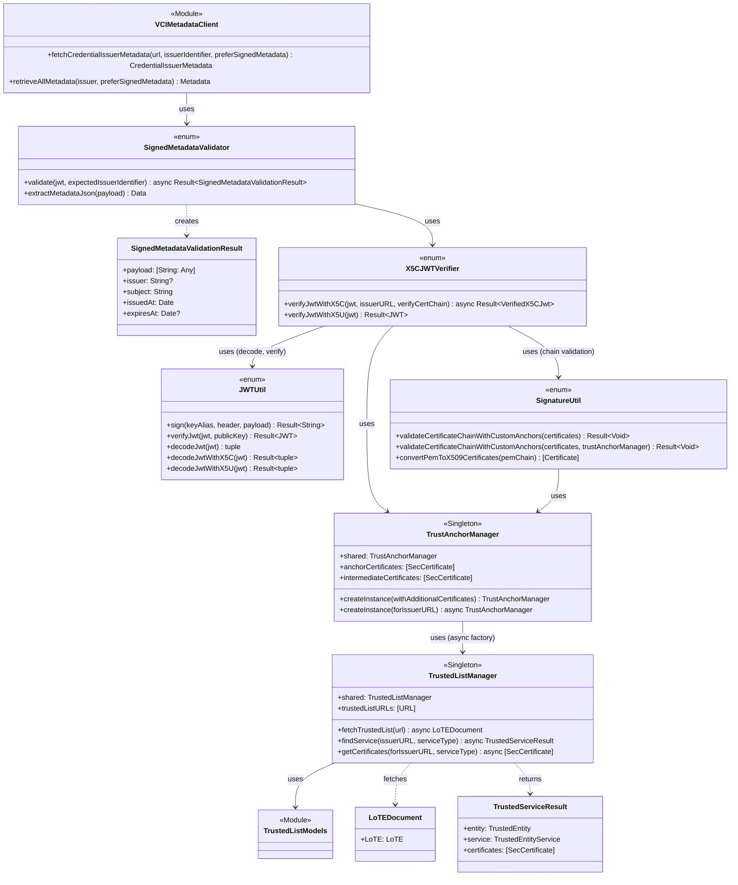
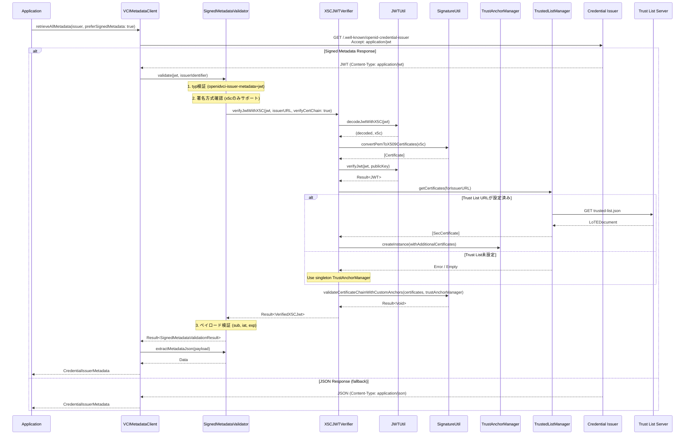
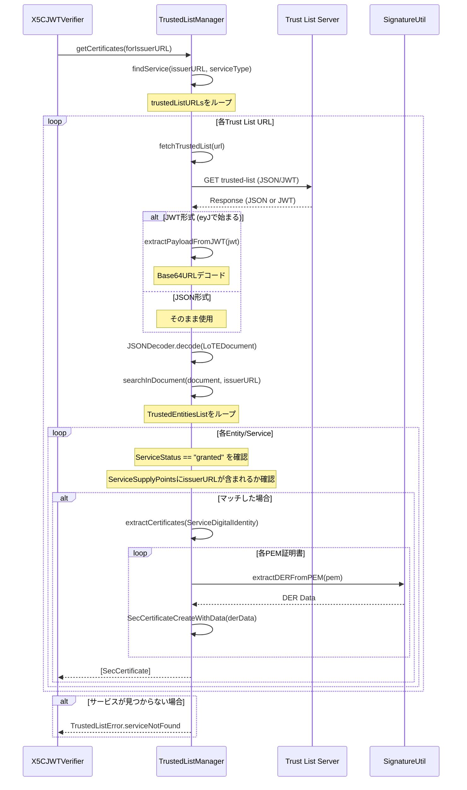
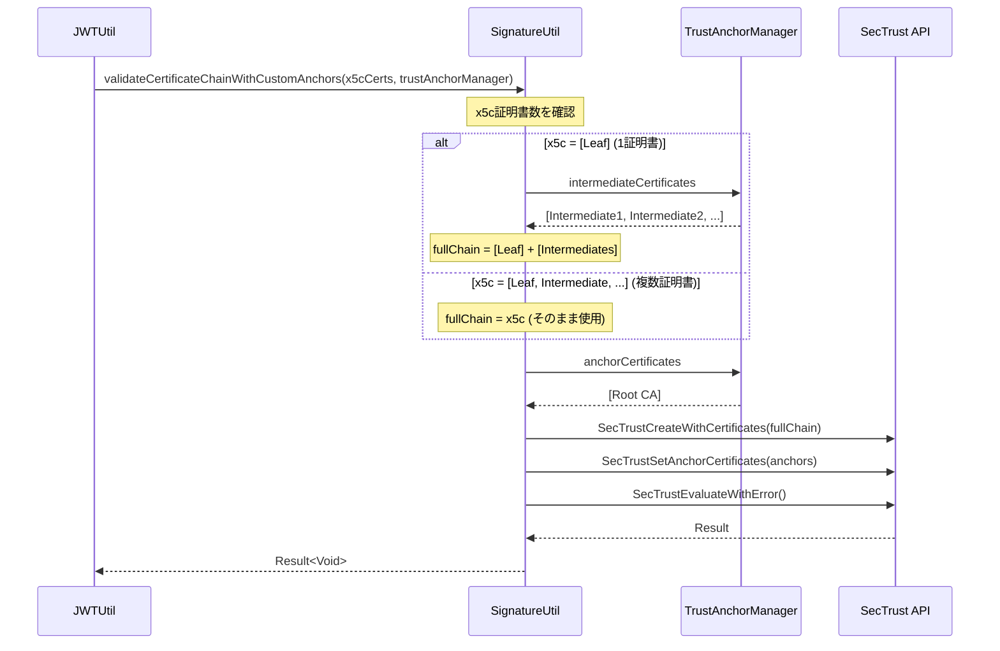

# Credential Issuance - Metadata Verification

## Overview

OID4VCI 1.0 Section 12.2.2/12.2.3に準拠したメタデータの取得と検証機能を提供します。Issuerメタデータの信頼性を検証するため、署名付きメタデータ(Signed Metadata)とトラストリスト(ETSI TS 119 602 LoTE形式)に対応しています。

### 主な機能

| 機能 | 説明 | 仕様 |
|------|------|------|
| Signed Metadata | 署名付きメタデータの検証 | OID4VCI 1.0 Section 12.2.3 |
| Accept Header制御 | 署名付き/JSONメタデータの選択 | OID4VCI 1.0 Section 12.2.2 |
| Trust List | トラストリストからの証明書取得 | ETSI TS 119 602 |

### 対応状況

- ✅ 署名方式: x5c (証明書チェーン)
- ⏳ 署名方式: kid (未サポート)
- ⏳ 署名方式: trust_chain (未サポート)

## Class Diagram



## Sequence Diagram

### メタデータ取得フロー (Signed Metadata)



### TrustedListManager内部処理フロー



### 証明書チェーン検証フロー



## API Reference

### VCIMetadataClient

メタデータ取得のエントリポイント。

```swift
// tw2023_wallet/Services/OID/VCI/VCIMetadataClient.swift

/// Credential Issuerメタデータを取得
/// - Parameters:
///   - url: メタデータエンドポイントURL
///   - issuerIdentifier: Credential Issuer識別子 (sub検証用)
///   - preferSignedMetadata: true=署名付き(application/jwt), false=JSON(application/json)
/// - Returns: CredentialIssuerMetadata
func fetchCredentialIssuerMetadata(
    from url: URL,
    issuerIdentifier: String,
    preferSignedMetadata: Bool = false,
    using session: URLSession = URLSession.shared
) async throws -> CredentialIssuerMetadata

/// すべてのメタデータ (Issuer + Authorization Server) を取得
func retrieveAllMetadata(
    issuer: String,
    preferSignedMetadata: Bool = false,
    using session: URLSession = URLSession.shared
) async throws -> Metadata
```

### SignedMetadataValidator

署名付きメタデータの検証。

```swift
// tw2023_wallet/Services/OID/VCI/SignedMetadataValidator.swift

enum SignedMetadataValidator {
    /// 署名付きメタデータを検証 (TrustedList対応)
    static func validate(
        jwt: String,
        expectedIssuerIdentifier: String
    ) async -> Result<SignedMetadataValidationResult, SignedMetadataError>

    /// ペイロードからメタデータJSONを抽出
    static func extractMetadataJson(from payload: [String: Any]) throws -> Data
}

/// 検証結果
struct SignedMetadataValidationResult {
    let payload: [String: Any]
    let issuer: String?      // iss (OPTIONAL)
    let subject: String      // sub (REQUIRED) = Credential Issuer識別子
    let issuedAt: Date       // iat (REQUIRED)
    let expiresAt: Date?     // exp (OPTIONAL)
}
```

### TrustedListManager

ETSI TS 119 602 LoTE形式のトラストリスト管理。

```swift
// tw2023_wallet/Services/TrustedList/TrustedListManager.swift

class TrustedListManager {
    static let shared = TrustedListManager()

    /// 設定されたトラストリストURL
    private(set) var trustedListURLs: [URL]

    /// トラストリストをフェッチ (JSON/JWT両形式対応)
    func fetchTrustedList(from url: URL) async throws -> LoTEDocument

    /// 発行者URLに対応するサービスエントリを検索
    func findService(
        issuerURL: String,
        serviceType: String = TrustedListServiceType.credentialIssuance
    ) async throws -> TrustedServiceResult

    /// 発行者URLから証明書を取得
    func getCertificates(
        forIssuerURL issuerURL: String,
        serviceType: String = TrustedListServiceType.credentialIssuance
    ) async throws -> [SecCertificate]
}

/// サービス検索結果
struct TrustedServiceResult {
    let entity: TrustedEntity
    let service: TrustedEntityService
    let certificates: [SecCertificate]
}
```

### TrustAnchorManager

信頼アンカー証明書の管理。

```swift
// tw2023_wallet/Signature/TrustAnchorManager.swift

class TrustAnchorManager {
    static let shared = TrustAnchorManager()

    /// ルートCA証明書
    private(set) var anchorCertificates: [SecCertificate]

    /// 中間証明書
    private(set) var intermediateCertificates: [SecCertificate]

    /// カスタムアンカーが設定されているか
    var hasCustomAnchors: Bool

    /// 追加証明書を持つ使い捨てインスタンスを生成
    /// (シングルトンの証明書を継承 + 追加証明書)
    static func createInstance(
        withAdditionalCertificates additionalCertificates: [SecCertificate]
    ) -> TrustAnchorManager

    /// 発行者URLからトラストリストの証明書を取得してインスタンス生成
    static func createInstance(
        forIssuerURL issuerURL: String,
        serviceType: String = TrustedListServiceType.credentialIssuance
    ) async throws -> TrustAnchorManager
}
```

### X5CJWTVerifier

x5c/x5uヘッダーを使用したJWT検証のラッパー層。JWTUtilとSignatureUtilを統合して証明書チェーン検証を行う。

```swift
// tw2023_wallet/Signature/X5CJWTVerifier.swift

enum X5CJWTVerifier {
    typealias VerifiedX5CJwt = (decoded: JWT, certs: [Certificate])

    /// x5cヘッダーでJWTを検証 (署名検証 + 証明書チェーン検証)
    static func verifyJwtWithX5C(
        jwt: String,
        issuerURL: String?,
        verifyCertChain: Bool = true
    ) async -> Result<VerifiedX5CJwt, JWTVerificationError>

    /// x5uヘッダーでJWTを検証
    static func verifyJwtWithX5U(
        jwt: String
    ) -> Result<JWT, JWTVerificationError>
}
```

### JWTUtil

純粋なJWT操作（署名、検証、デコード）を提供。

```swift
// tw2023_wallet/Signature/JWTUtil.swift

enum JWTUtil {
    /// JWTに署名
    static func sign(
        keyAlias: String,
        header: [String: Any],
        payload: [String: Any]
    ) -> Result<String, SignatureError>

    /// 公開鍵でJWT署名を検証
    static func verifyJwt(
        jwt: String,
        publicKey: SecKey
    ) -> Result<JWT, JWTVerificationError>

    /// JWTをデコード
    static func decodeJwt(jwt: String) throws -> ([String: Any], [String: Any], String?)

    /// JWTをデコードしてx5cヘッダーを抽出
    static func decodeJwtWithX5C(
        jwt: String
    ) -> Result<(decoded: JWT, x5c: [String]), JWTVerificationError>

    /// JWTをデコードしてx5uヘッダーを抽出
    static func decodeJwtWithX5U(
        jwt: String
    ) -> Result<(decoded: JWT, x5uUrl: String), JWTVerificationError>
}
```

## Error Types

### SignedMetadataError

```swift
enum SignedMetadataError: LocalizedError {
    case unsupportedSignatureMethod(String)  // x5c以外の署名方式
    case invalidTyp(String)                   // typ != openidvci-issuer-metadata+jwt
    case missingRequiredClaim(String)         // sub, iat等の必須クレーム欠落
    case subjectMismatch(expected: String, actual: String)  // sub不一致
    case expiredMetadata                      // 期限切れ
    case signatureVerificationFailed(String)  // 署名検証失敗
    case certificateValidationFailed(String)  // 証明書チェーン検証失敗
}
```

### MetadataError

```swift
enum MetadataError: LocalizedError {
    // ... (既存のエラー)
    case signedMetadataValidationFailed(SignedMetadataError)
    case contentTypeMismatch(expected: String, actual: String)
}
```

### TrustedListError

```swift
enum TrustedListError: Error {
    case urlsFileNotFound
    case invalidURL(String)
    case fetchFailed(URL, Error)
    case parseError(Error)
    case serviceNotFound(issuerURL: String, serviceType: String)
    case noCertificatesInService
    case certificateParseError
}
```

## Data Models

### Signed Metadata JWT Structure

```json
{
  "header": {
    "alg": "ES256",
    "typ": "openidvci-issuer-metadata+jwt",
    "x5c": ["<leaf-cert-base64>", "<intermediate-cert-base64>", ...]
  },
  "payload": {
    "iss": "<party attesting to claims>",
    "sub": "<credential-issuer-identifier>",
    "iat": 1234567890,
    "exp": 1234567890,
    "credential_issuer": "...",
    "credential_endpoint": "...",
    "credential_configurations_supported": { ... }
  }
}
```

### LoTE Document Structure (ETSI TS 119 602)

```json
{
  "LoTE": {
    "ListAndSchemeInformation": {
      "SchemeOperatorName": [{ "lang": "en", "value": "Operator Name" }],
      "ListIssueDateTime": "2026-01-01T00:00:00Z",
      "NextUpdate": "2026-06-01T00:00:00Z"
    },
    "TrustedEntitiesList": [
      {
        "TrustedEntityInformation": {
          "TEName": [{ "lang": "en", "value": "Entity Name" }]
        },
        "TrustedEntityServices": [
          {
            "ServiceInformation": {
              "ServiceTypeIdentifier": "http://example.com/SvcType/CredentialIssuance",
              "ServiceStatus": "http://uri.etsi.org/TrstSvc/TrustedList/Svcstatus/granted",
              "ServiceSupplyPoints": [
                { "uriValue": "https://issuer.example.com" }
              ],
              "ServiceDigitalIdentity": {
                "X509Certificates": ["-----BEGIN CERTIFICATE-----\n...\n-----END CERTIFICATE-----"]
              }
            }
          }
        ]
      }
    ]
  }
}
```

## Implementation Files

| File | Description |
|------|-------------|
| `tw2023_wallet/Services/OID/VCI/VCIMetadataClient.swift` | メタデータ取得クライアント |
| `tw2023_wallet/Services/OID/VCI/SignedMetadataValidator.swift` | 署名付きメタデータ検証 |
| `tw2023_wallet/Services/TrustedList/TrustedListManager.swift` | トラストリスト管理 |
| `tw2023_wallet/Services/TrustedList/TrustedListModels.swift` | LoTEデータモデル |
| `tw2023_wallet/Signature/TrustAnchorManager.swift` | 信頼アンカー証明書管理 |
| `tw2023_wallet/Signature/X5CJWTVerifier.swift` | x5c/x5u JWT検証ラッパー |
| `tw2023_wallet/Signature/JWTUtil.swift` | JWT操作ユーティリティ |
| `tw2023_wallet/Signature/SignatureUtil.swift` | 証明書チェーン検証 |

## Configuration

### Trust List URLs (TrustedListURLs.txt)

```text
# Trusted List URLs (one per line)
# Lines starting with # are comments
# JSON形式とJWT形式の両方に対応
https://example.jp/trusted-list.json
https://example.jp/trusted-list.jwt
```

### Build Phase設定

Xcode Build Phaseに「Copy Trusted List URLs」スクリプトを追加:

```bash
URLS_SOURCE="${SRCROOT}/TrustedListURLs.txt"
URLS_DEST="${BUILT_PRODUCTS_DIR}/${UNLOCALIZED_RESOURCES_FOLDER_PATH}/TrustedListURLs.txt"

if [ -f "$URLS_SOURCE" ]; then
    cp "$URLS_SOURCE" "$URLS_DEST"
    echo "TrustedListURLs.txt copied to bundle"
else
    echo "TrustedListURLs.txt not found (optional)"
fi
```

## References

### Specifications

- [OID4VCI 1.0 Section 12.2.2 - Obtaining Credential Issuer Metadata](https://openid.net/specs/openid-4-verifiable-credential-issuance-1_0.html#section-12.2.2)
- [OID4VCI 1.0 Section 12.2.3 - Signed Metadata](https://openid.net/specs/openid-4-verifiable-credential-issuance-1_0.html#section-12.2.3)
- [ETSI TS 119 602 - Trusted Lists](https://www.etsi.org/deliver/etsi_ts/119600_119699/119602/01.01.01_60/ts_119602v010101p.pdf)
- [RFC 7515 - JSON Web Signature](https://www.rfc-editor.org/rfc/rfc7515.html)

### Related Documentation

- [X.509 Certificate Chain Validation](../../x509-certificate-chain-validation.md)
- [API Reference](./api.md)
- [Security](./security.md)

### Work Documents

- [Signed Metadata Implementation](../../work/2026-01-05-signed-metadata-implementation.md)
- [Accept Header Fix](../../work/2026-01-06-signed-metadata-accept-header-fix.md)
- [Trust List Support](../../work/2026-01-07-work-trusted-list-support.md)
- [Metadata Validation Refactoring](../../work/2026-01-08-metadata-validation-refactoring.md)
- [JWT Chain Validation Refactoring](../../work/2026-01-08-refactor-jwt-chain-validation.md)
