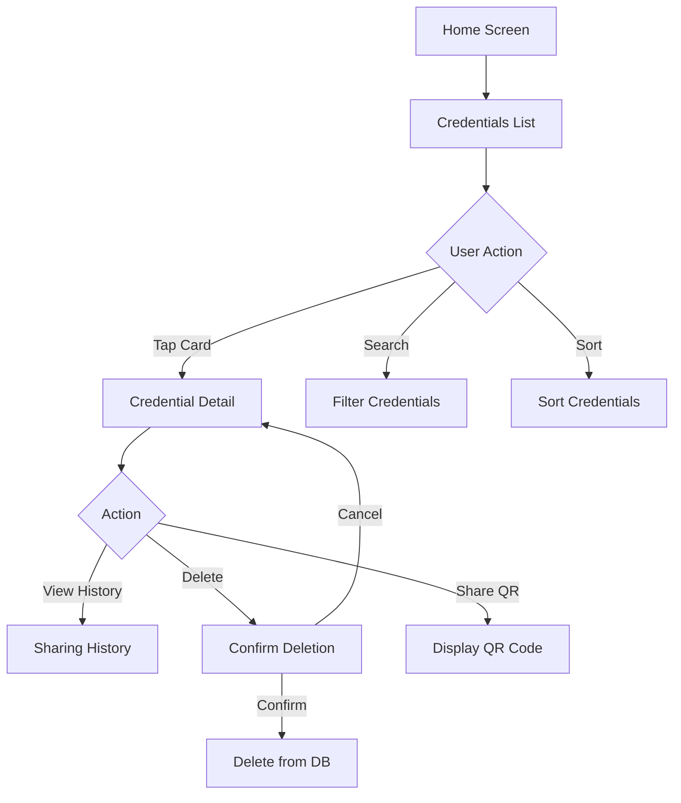

# Credential Management

## Status
- [x] Draft
- [ ] Review
- [ ] Approved
- [x] Implemented
- [ ] Verified

## Overview

ウォレット内のVerifiable Credentialsを管理する機能です。

## User Stories

- As a user, I want to view all my credentials in one place
- As a user, I want to see detailed information about each credential
- As a user, I want to delete credentials I no longer need
- As a user, I want to search and filter my credentials
- As a user, I want to see the sharing history of each credential

## Requirements

### Functional Requirements

1. **Credential List**
   - すべてのCredentialの一覧表示
   - Credentialカードビュー
   - ソート機能（日付、Issuer、タイプ）

2. **Credential Detail**
   - Credential詳細情報表示
   - Claims/Attributes表示
   - Issuer情報
   - 発行日・有効期限
   - QRコード表示（共有用）

3. **Credential Deletion**
   - Credentialの削除
   - 確認ダイアログ
   - 削除の取り消し不可の警告

4. **Search & Filter**
   - テキスト検索
   - タイプフィルター
   - Issuerフィルター
   - 有効期限フィルター

5. **Sharing History**
   - Credential別の共有履歴
   - 共有先（Verifier）
   - 共有日時
   - 共有した属性

### Non-Functional Requirements

1. **Performance**
   - Credential一覧の高速表示
   - スムーズなスクロール
   - 検索のリアルタイム応答

2. **Usability**
   - 直感的なUI
   - わかりやすいCredential表示
   - 簡単な操作

3. **Accessibility**
   - VoiceOver対応
   - Dynamic Type対応

## Design

### UI/UX Design

#### Screens

1. **Credentials List Screen**
   - Credentialカード一覧
   - 検索バー
   - フィルターボタン
   - ソートオプション

2. **Credential Detail Screen**
   - Credentialタイプ
   - Issuer情報（ロゴ、名前）
   - 発行日
   - 有効期限
   - Claims一覧
   - QRコードボタン
   - 共有履歴ボタン
   - 削除ボタン

3. **Sharing History Screen**
   - 共有履歴リスト
   - 各履歴の詳細（Verifier、日時、属性）

4. **Credential Card Component**
   - Issuerロゴ
   - Credentialタイプ
   - 発行日
   - 有効期限インジケーター
   - ステータスバッジ（有効/期限切れ）

### Data Flow



## Implementation Plan

- [x] Credential一覧表示
- [x] Credentialカードコンポーネント
- [x] Credential詳細画面
- [x] Credential削除機能
- [ ] 検索機能
- [ ] フィルター機能
- [ ] ソート機能
- [x] 共有履歴表示
- [x] QRコード生成・表示
- [ ] 有効期限通知
- [ ] 有効期限チェック機能（`isExpired`, `isExpiringSoon`）

## API Overview

**Note**: プロトコルは定義されておらず、以下のクラスに機能が分散実装されています。

### ViewModels

```swift
// tw2023_wallet/Feature/Credentials/ViewModels/CredentialListViewModel.swift
@Observable
class CredentialListViewModel {
    var credentials: [Credential] = []
    var filteredCredentials: [Credential] = []
    var isLoading: Bool = false

    func loadData()
    func filterCredential(filter: String)
    func deleteCredential(credential: Credential) async
}

// tw2023_wallet/Feature/Credentials/ViewModels/CredentialDetailViewModel.swift
@Observable
class CredentialDetailViewModel {
    var credential: Credential?
    var showQR: Bool = false
    // Credential詳細表示とQRコード表示を管理
}
```

### Data Manager

```swift
// tw2023_wallet/datastore/CredentialDataManager.swift
class CredentialDataManager {
    func saveCredentialData(credentialData: Datastore_CredentialData)
    func getAllCredentials() -> [Datastore_CredentialData]
    func getCredentialById(id: String) -> Datastore_CredentialData?
    func deleteCredentialById(id: String)
}

// tw2023_wallet/datastore/CredentialSharingHistoryManager.swift
class CredentialSharingHistoryManager {
    func getAllCredentialSharingHistory() -> [CredentialSharingHistory]
    func saveCredentialSharingHistory(history: Datastore_CredentialSharingHistory)
    func deleteCredentialSharingHistoryByRp(rp: String)
}
```

## Data Model

### Credential Model

**File**: `tw2023_wallet/Models/Credential.swift`

```swift
struct Credential: Codable, Identifiable, Hashable {
    var id: String
    var format: String
    var payload: String
    var issuer: String
    let issuerDisplayName: String
    var issuedAt: String
    var logoUrl: String?
    var backgroundColor: String?
    var backgroundImageUrl: String?
    var textColor: String?
    var credentialType: String
    var disclosure: [String: String]?
    var certificates: [Certificate?]?
    var qrDisplay: String
    var metaData: CredentialIssuerMetadata

    var backgroundImage: AnyView?
    var logoImage: AnyView?
}
```

**Note**: 有効期限チェック機能（`isExpired`, `isExpiringSoon`）は現在未実装です。将来的な拡張として検討中。

### Credential Sharing History

**Protocol Buffers**: `tw2023_wallet/proto/credential_sharing_history.proto`

```proto
message CredentialSharingHistory {
  string rp = 1;
  int32 accountIndex = 2;
  google.protobuf.Timestamp createdAt = 3;
  string credentialID = 4;
  repeated ClaimInfo claims = 5;
  string logoURL = 6;
  string rpName = 7;
  string privacyPolicyURL = 8;
}

message ClaimInfo {
    string claimKey = 1;
    string claimValue = 2;
    string purpose = 3;
}
```

**Swift Model**: `tw2023_wallet/Models/CredentialSharingHistory.swift`

```swift
struct CredentialSharingHistory: Codable, Hashable, History {
    let rp: String
    let accountIndex: Int
    let createdAt: String
    let credentialID: String
    var claims: [ClaimInfo]
    var rpName: String
    var privacyPolicyUrl: String
    var logoUrl: String
}

struct ClaimInfo: Codable {
    var claimKey: String
    var claimValue: String
    var purpose: String?
}
```

**CoreData Entity**: `CredentialSharingHistoryEntity`

## Security Considerations

### Threats

1. **Unauthorized Deletion**
   - Mitigation: 確認ダイアログ、認証要求（機密Credential）

2. **Data Leakage**
   - Mitigation: スクリーンキャプチャ防止（詳細画面）

### Security Checklist

- [x] 削除前の確認
- [ ] 機密Credential削除時の認証
- [ ] スクリーンキャプチャ防止
- [x] セキュアなデータ保存

## Testing Strategy

### Unit Tests

- Credential一覧取得
- 検索ロジック
- フィルターロジック
- ソートロジック
- 削除処理

### UI Tests

- Credentialリスト表示
- Credential詳細表示
- 削除フロー
- 検索/フィルター

## Performance Metrics

- Credential一覧表示: < 500ms
- 詳細画面表示: < 200ms
- 検索応答: < 300ms
- 削除処理: < 500ms

## Accessibility

- VoiceOverでのナビゲーション
- Dynamic Typeサポート
- カラーコントラスト確保
- タッチターゲットサイズ（最小44x44pt）

## References

- Implementation: `tw2023_wallet/Feature/Credentials/`
- Data Manager: `tw2023_wallet/datastore/CredentialDataManager.swift`
- Models: `tw2023_wallet/Models/Credential.swift`
