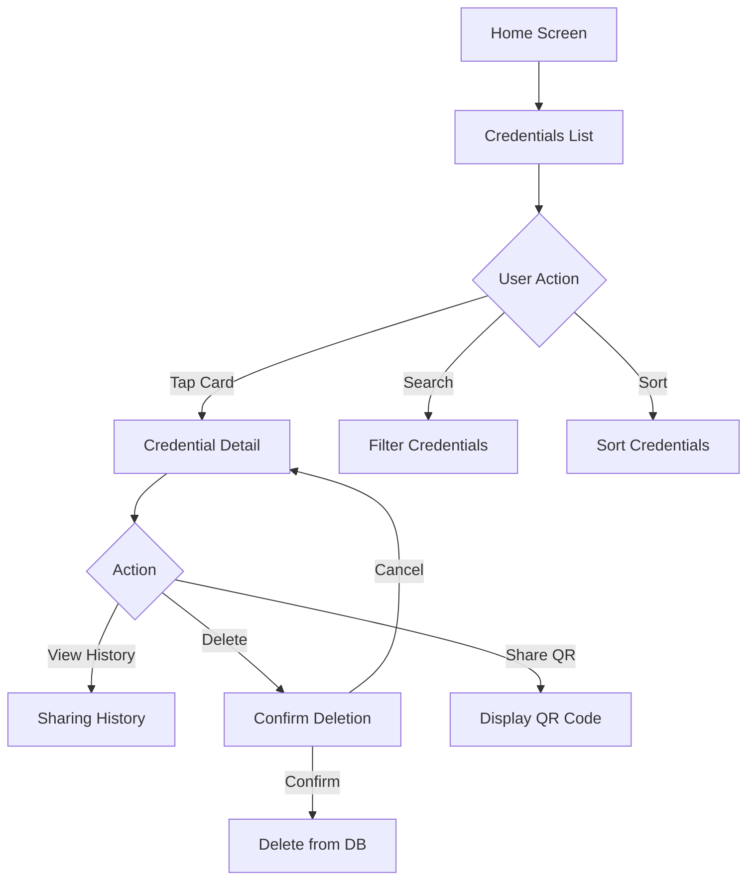

# Credential Management - Design

## UI/UX Design

### Screens

1. **Credentials List Screen**
   - Credentialカード一覧
   - 検索バー
   - フィルターボタン
   - ソートオプション

2. **Credential Detail Screen**
   - Credentialタイプ
   - Issuer情報（ロゴ、名前）
   - 発行日
   - 有効期限
   - Claims一覧
   - QRコードボタン
   - 共有履歴ボタン
   - 削除ボタン

3. **Sharing History Screen**
   - 共有履歴リスト
   - 各履歴の詳細（Verifier、日時、属性）

4. **Credential Card Component**
   - Issuerロゴ
   - Credentialタイプ
   - 発行日
   - 有効期限インジケーター
   - ステータスバッジ（有効/期限切れ）

## Data Flow

## Accessibility

- VoiceOverでのナビゲーション
- Dynamic Typeサポート
- カラーコントラスト確保
- タッチターゲットサイズ（最小44x44pt）
