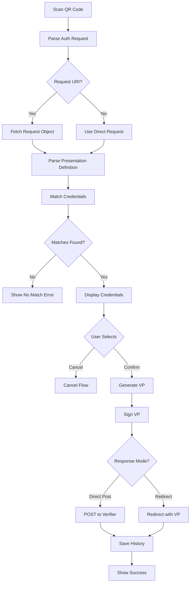

# Credential Presentation (OID4VP)

## Status
- [x] Draft
- [ ] Review
- [ ] Approved
- [x] Implemented
- [ ] Verified

## Overview

OID4VP (OpenID for Verifiable Presentations) プロトコルを使用して、VerifierにVerifiable Presentationを提示する機能です。

## User Stories

- As a user, I want to scan a QR code to present my credentials to a verifier
- As a user, I want to select which credentials to share from my wallet
- As a user, I want to see what information will be shared before confirming
- As a user, I want to review my sharing history

## Requirements

### Functional Requirements

1. **Authorization Request Parsing**
   - QRコードまたはDeep Linkからリクエスト受信
   - Request URIからのJWT取得
   - Presentation Definitionの解析

2. **Credential Matching**
   - Input Descriptorsとの照合
   - 適合するCredentialの抽出
   - 複数Descriptorへの対応

3. **Credential Selection**
   - ユーザーへの選択肢提示
   - 選択的開示のサポート
   - 必須/任意フィールドの区別

4. **VP Generation**
   - Verifiable Presentationの生成
   - JWT-VPフォーマット対応
   - Presentation Submissionの生成

5. **VP Submission**
   - Direct Post対応
   - Redirect対応
   - レスポンスハンドリング

6. **History Management**
   - 共有履歴の記録
   - 共有内容の保存

### Non-Functional Requirements

1. **Security**
   - ユーザー同意なしの共有防止
   - VP署名の適切な実施
   - Verifierの検証

2. **Privacy**
   - 最小限の情報開示
   - 選択的開示
   - トラッキング防止（Pairwise識別子）

3. **Performance**
   - Credential照合: 1秒以内
   - VP生成: 2秒以内
   - 全体フロー: 10秒以内

4. **Usability**
   - 明確な情報開示表示
   - わかりやすい選択UI
   - 確認プロセス

## Design

### UI/UX Design

#### Screens

1. **Request Review Screen**
   - Verifier情報
   - 要求される情報の概要
   - Accept/Declineボタン

2. **Credential Selection Screen**
   - マッチしたCredentialリスト
   - 各Credentialの詳細
   - 共有される属性の表示
   - Confirmボタン

3. **Confirmation Screen**
   - 共有内容のサマリー
   - Verifier情報の再確認
   - Final Confirmボタン

4. **Processing Screen**
   - VP生成中の表示
   - 進捗インジケーター

5. **Success Screen**
   - 成功メッセージ
   - Redirect URLの表示（該当する場合）
   - Doneボタン

### Data Flow



### Sequence Diagram

See [Sequence Diagrams](../architecture/diagrams/sequence-diagrams.md#2-credential-presentation-flow-oid4vp)

## Implementation Plan

- [x] Authorization Request解析
- [x] Request URI取得
- [x] Presentation Definition解析
- [x] Input Descriptor照合（Presentation Exchange）
- [x] Credential選択UI
- [x] VP生成
- [x] VP署名（JWT）
- [x] Direct Post実装
- [ ] Redirect実装（将来）
- [x] 共有履歴保存
- [ ] 選択的開示の高度化

## API Overview

**Note**: プロトコルは定義されておらず、以下のクラスと関数に機能が分散実装されています。

### OpenIdProvider

**File**: `tw2023_wallet/Services/OID/Provider/OpenIdProvider.swift`

```swift
class OpenIdProvider {
    var authRequestProcessedData: ProcessedRequestData?
    var clientId: String?
    var responseType: String?
    var responseMode: ResponseMode?
    var nonce: String?
    var state: String?
    var redirectUri: String?
    var responseUri: String?
    var presentationDefinition: PresentationDefinition?

    func processAuthRequest(_ url: String, using session: URLSession = URLSession.shared) async
        -> Result<ProcessedRequestData, AuthorizationRequestError>

    func respondToken(
        credentials: [SubmissionCredential]?,
        using session: URLSession = URLSession.shared
    ) async -> Result<TokenSendResult, Error>
}

struct ProcessedRequestData {
    var authorizationRequest: AuthorizationRequestPayload
    var requestObjectJwt: String
    var requestObject: RequestObjectPayload?
    var clientMetadata: RPRegistrationMetadataPayload
    var presentationDefinition: PresentationDefinition?
    var requestIsSigned: Bool
}
```

### Authorization Request Processing

**File**: `tw2023_wallet/Services/OID/AuthorizationRequest.swift`

```swift
func parseAndResolve(from uri: String, using session: URLSession = URLSession.shared) async
    -> Result<ProcessedRequestData, AuthorizationRequestError>

func parse(uri: String) throws -> (String, AuthorizationRequestPayload)

func processRequestObject(
    _ authorizationRequest: AuthorizationRequestPayload,
    using session: URLSession = URLSession.shared
) async throws -> (String, RequestObjectPayload)

func processClientMetadata(
    _ authorizationRequest: AuthorizationRequestPayload, _ requestObject: RequestObjectPayload?,
    using session: URLSession = URLSession.shared
) async throws -> RPRegistrationMetadataPayload

func processPresentationDefinition(
    _ authorizationRequest: AuthorizationRequestPayload, _ requestObject: RequestObjectPayload?,
    using session: URLSession = URLSession.shared
) async throws -> PresentationDefinition?
```

### Presentation Exchange

**File**: `tw2023_wallet/Services/OID/PresentationExchange.swift`

```swift
struct PresentationDefinition: Codable {
    let id: String
    let inputDescriptors: [InputDescriptor]
    let name: String?
    let purpose: String?
    let submissionRequirements: [SubmissionRequirement]?

    func firstMatchedInputDescriptor(sdJwt: String) -> (InputDescriptor, [DisclosureWithOptionality])?
    func satisfyConstrains(credential: [String: Any]) -> Bool
}

struct InputDescriptor: Codable {
    let id: String
    let name: String?
    let purpose: String?
    let format: [String: ClaimFormat]?
    let constraints: InputDescriptorConstraints
    let group: [String]?

    func filterKeysWithOptionality(from sourcePayload: [String: String]) -> [(String, Bool)]
}

struct InputDescriptorConstraints: Codable {
    let fields: [Field]?
    let limitDisclosure: LimitDisclosure?
    let subjectIsIssuer: SubjectIsIssuer?
}
```

### Data Models

**File**: `tw2023_wallet/Services/OID/VCI/AuthRequest.swift`

```swift
protocol AuthorizationRequestPayload: AuthorizationRequestCommonPayload {
    var request: String? { get }
    var requestUri: String? { get }
}

protocol AuthorizationRequestCommonPayload {
    var scope: String? { get }
    var responseType: String? { get }
    var clientId: String? { get }
    var redirectUri: String? { get }
    var idTokenHint: String? { get }
    var nonce: String? { get }
    var state: String? { get }
    var responseMode: ResponseMode? { get }
    var maxAge: Int? { get }
    var clientMetadata: RPRegistrationMetadataPayload? { get }
    var clientMetadataUri: String? { get }
    var responseUri: String? { get }
    var presentationDefinition: PresentationDefinition? { get }
    var presentationDefinitionUri: String? { get }
    var clientIdScheme: String? { get }
}

struct RPRegistrationMetadataPayload: Codable {
    var scopesSupported: [Scope]?
    var subjectTypesSupported: [SubjectType]?
    var idTokenSigningAlgValuesSupported: [SigningAlgo]?
    var requestObjectSigningAlgValuesSupported: [SigningAlgo]?
    var subjectSyntaxTypesSupported: [String]?
    var clientId: String?
    var clientName: String?
    var vpFormats: [String: [String: [String]]]?
    var logoUri: String?
    var policyUri: String?
    var tosUri: String?
    var clientPurpose: String?
    var jwks: String?
    var jwksUri: String?
    var vpFormatsSupported: Format?
}
```

## Data Model

### Credential Sharing History

**Protocol Buffers**: `tw2023_wallet/proto/credential_sharing_history.proto`

```proto
message CredentialSharingHistory {
  string rp = 1;
  int32 accountIndex = 2;
  google.protobuf.Timestamp createdAt = 3;
  string credentialID = 4;
  repeated ClaimInfo claims = 5;
  string logoURL = 6;
  string rpName = 7;
  string privacyPolicyURL = 8;
}

message ClaimInfo {
    string claimKey = 1;
    string claimValue = 2;
    string purpose = 3;
}
```

**Swift Model**: `tw2023_wallet/Models/CredentialSharingHistory.swift`

```swift
struct CredentialSharingHistory: Codable, Hashable, History {
    let rp: String
    let accountIndex: Int
    let createdAt: String
    let credentialID: String
    var claims: [ClaimInfo]
    var rpName: String
    var privacyPolicyUrl: String
    var logoUrl: String
}

struct ClaimInfo: Codable {
    var claimKey: String
    var claimValue: String
    var purpose: String?
}
```

**CoreData Entity**: `CredentialSharingHistoryEntity`

## Security Considerations

### Threats

1. **Phishing Attack**
   - Mitigation: Verifier情報の明確な表示、信頼できるVerifierリスト（将来）

2. **Over-Disclosure**
   - Mitigation: 選択的開示、最小限の情報共有、ユーザー確認

3. **VP Replay**
   - Mitigation: Nonce使用、タイムスタンプ、ワンタイムVP

4. **Correlation Attack**
   - Mitigation: Pairwise識別子、ブラインド署名（将来）

### Security Checklist

- [x] ユーザー同意の取得
- [x] VP署名の実施
- [x] Nonce検証
- [x] HTTPS通信
- [ ] Verifier認証（将来）
- [ ] 選択的開示の高度化

## Testing Strategy

### Unit Tests

- Presentation Definition解析
- Input Descriptor照合ロジック
- VP生成
- 署名検証

### Integration Tests

- End-to-endプレゼンテーションフロー
- 実際のVerifierとの連携

### UI Tests

- Credential選択フロー
- 確認プロセス
- キャンセル処理

## Error Handling

```swift
enum PresentationError: Error {
    case invalidRequest(String)
    case noMatchingCredentials
    case vpGenerationFailed(String)
    case submissionFailed(Error)
    case userCancelled
}
```

## Performance Metrics

- Request解析: < 1秒
- Credential照合: < 1秒
- VP生成: < 2秒
- VP送信: < 3秒
- 全体フロー: < 10秒

## References

- [OID4VP Specification](https://openid.net/specs/openid-4-verifiable-presentations-1_0-18.html)
- [Presentation Exchange Specification](https://identity.foundation/presentation-exchange/)
- Implementation: `tw2023_wallet/Services/OID/PresentationExchange.swift`
