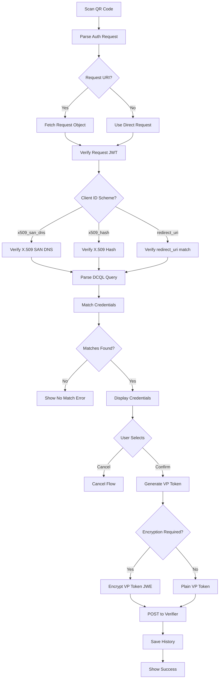

# Credential Presentation (OID4VP)

## Status
- [x] Draft
- [ ] Review
- [ ] Approved
- [x] Implemented
- [ ] Verified

## Overview

OID4VP (OpenID for Verifiable Presentations) 1.0 プロトコルを使用して、VerifierにVerifiable Presentationを提示する機能です。

**仕様バージョン**: OID4VP 1.0 (openid-4-verifiable-presentations-1_0)

## User Stories

- As a user, I want to scan a QR code to present my credentials to a verifier
- As a user, I want to select which credentials to share from my wallet
- As a user, I want to see what information will be shared before confirming
- As a user, I want to control which claims are disclosed (selective disclosure)
- As a user, I want to review my sharing history

## Requirements

### Functional Requirements

1. **Authorization Request Parsing**
   - QRコードまたはDeep Linkからリクエスト受信
   - Request URIからのJWT取得
   - DCQL (Digital Credentials Query Language) の解析
   - Client ID Scheme の検証 (x509_san_dns, x509_hash, redirect_uri)

2. **Credential Matching (DCQL)**
   - DCQL Credential Queryとの照合
   - フォーマットマッチング (dc+sd-jwt, vc+sd-jwt, jwt_vc_json)
   - VCT (Verifiable Credential Type) マッチング
   - クレームパスマッチング

3. **Selective Disclosure**
   - OID4VP 1.0 Section 6.4.1 に準拠したクレーム選択
   - `claims` absent: 選択的開示クレームなし（必須クレームのみ）
   - `claims` present: 指定されたクレームのみ開示
   - 必須/任意フィールドの区別

4. **VP Token Generation**
   - SD-JWT VC の選択的開示処理
   - Key Binding JWT の生成
   - JWT-VP フォーマット対応

5. **VP Token Encryption (HAIP対応)**
   - JWE暗号化 (ECDH-ES + A128GCM)
   - Concat KDF (NIST SP 800-56A)
   - response_mode: direct_post.jwt

6. **VP Submission**
   - Direct Post対応 (response_mode: direct_post)
   - Direct Post JWT対応 (response_mode: direct_post.jwt)
   - レスポンスハンドリング

7. **History Management**
   - 共有履歴の記録
   - 共有内容の保存

### Non-Functional Requirements

1. **Security**
   - ユーザー同意なしの共有防止
   - VP署名の適切な実施
   - X.509証明書によるVerifier検証
   - VP Token暗号化（HAIP）

2. **Privacy**
   - 最小限の情報開示
   - OID4VP 1.0準拠の選択的開示
   - claims absent時は選択的開示クレームを含めない

3. **Performance**
   - Credential照合: 1秒以内
   - VP生成: 2秒以内
   - 全体フロー: 10秒以内

4. **Usability**
   - 明確な情報開示表示
   - わかりやすい選択UI
   - 確認プロセス

## Design

### UI/UX Design

#### Screens

1. **SharingRequest** (`Feature/ShareCredential/Views/SharingRequest.swift`)
   - メインのリクエスト画面
   - Verifier情報の表示 (`RecipientOrgInfo`)
   - 要求される情報の概要 (`ProvideAge`, `ProvideID`)
   - クレデンシャル選択状態の表示
   - Cancel / Provide Informationボタン

2. **CredentialListForSharing** (`Feature/Credentials/Views/CredentialListForSharing.swift`)
   - VP共有用のクレデンシャル選択画面
   - DCQLクエリにマッチしたクレデンシャルのリスト表示

3. **CredentialDetail** (`Feature/Credentials/Views/CredentialDetail.swift`)
   - クレデンシャル詳細画面（VP Mode）
   - 提供するクレーム（Sharing Contents of this certificate）
   - 提供しないクレーム（Not Sharing Contents of this certificate）
   - 任意選択クレーム（optional_to_provide）
   - Select This Credentialボタン

4. **RedirectView** (`Feature/ShareCredential/Views/RedirectView.swift`)
   - VP送信成功後のリダイレクト処理
   - WebViewによるVerifierサイトへの遷移

#### Supporting Components

- **RecipientOrgInfo** (`Feature/ShareCredential/Views/RecipientOrgInfo.swift`) - Verifier組織情報表示
- **ProvideAge** (`Feature/ShareCredential/Views/ProvideAge.swift`) - 年齢確認クレデンシャル表示
- **ProvideID** (`Feature/ShareCredential/Views/ProvideID.swift`) - ID確認クレデンシャル表示
- **DisclosureRow** (`Feature/Credentials/Views/DisclosureRow.swift`) - 個別クレーム表示行
- **StatusBox** - クレデンシャル選択状態表示

#### ViewModels

- **SharingRequestViewModel** (`Feature/ShareCredential/ViewModels/SharingRequestViewModel.swift`)
- **CredentialDetailViewModel** (`Feature/Credentials/ViewModels/CredentialDetailViewModel.swift`)
- **CredentialListViewModel** (`Feature/Credentials/ViewModels/CredentialListViewModel.swift`)

#### Models

- **SharingRequestModel** (`Feature/ShareCredential/Models/SharingRequesModel.swift`) - 共有リクエスト状態管理（@Observable）
- **SharingCredentialArgs** (`Feature/ShareCredential/Models/SharingCredentialArgs.swift`) - 画面遷移引数

### Data Flow


```mermaid
graph TD
    A[Scan QR Code] --> B[Parse Auth Request]
    B --> C{Request URI?}
    C -->|Yes| D[Fetch Request Object]
    C -->|No| E[Use Direct Request]
    D --> F[Verify Request JWT]
    E --> F
    F --> G{Client ID Scheme?}
    G -->|x509_san_dns| H[Verify X.509 SAN DNS]
    G -->|x509_hash| I[Verify X.509 Hash]
    G -->|redirect_uri| J[Verify redirect_uri match]
    H --> K[Parse DCQL Query]
    I --> K
    J --> K
    K --> L[Match Credentials]
    L --> M{Matches Found?}
    M -->|No| Z[Show No Match Error]
    M -->|Yes| N[Display Credentials]
    N --> O{User Selects}
    O -->|Cancel| Y[Cancel Flow]
    O -->|Confirm| P[Generate VP Token]
    P --> Q{Encryption Required?}
    Q -->|Yes| R[Encrypt VP Token JWE]
    Q -->|No| S[Plain VP Token]
    R --> T[POST to Verifier]
    S --> T
    T --> U[Save History]
    U --> V[Show Success]
```

## Implementation

### Implementation Status

- [x] Authorization Request解析
- [x] Request URI取得
- [x] Request Object JWT検証
- [x] Client ID Scheme検証 (x509_san_dns, x509_hash, redirect_uri)
- [x] DCQL Query解析
- [x] DCQL Credential Matching
- [x] 選択的開示 (OID4VP 1.0 Section 6.4.1)
- [x] VP Token生成 (SD-JWT VC)
- [x] VP Token生成 (JWT-VC-JSON)
- [x] Key Binding JWT生成
- [x] VP Token暗号化 (JWE: ECDH-ES + A128GCM)
- [x] Direct Post実装
- [x] Direct Post JWT実装
- [x] 共有履歴保存
- [ ] claim_sets対応（将来）
- [ ] values制限対応（将来）

## API Overview

### OpenIdProvider

**File**: `tw2023_wallet/Services/OID/Provider/OpenIdProvider.swift`

```swift
class OpenIdProvider {
    var authRequestProcessedData: ProcessedRequestData?
    var clientId: String?
    var responseType: String?
    var responseMode: ResponseMode?
    var nonce: String?
    var state: String?
    var redirectUri: String?
    var responseUri: String?
    var dcqlQuery: DcqlQuery?

    func processAuthRequest(_ url: String, using session: URLSession = URLSession.shared) async
        -> Result<ProcessedRequestData, AuthorizationRequestError>

    func respondToken(
        credentials: [SubmissionCredential]?,
        using session: URLSession = URLSession.shared
    ) async -> Result<TokenSendResult, Error>

    func createVpToken(
        credentials: [SubmissionCredential],
        using session: URLSession = URLSession.shared
    ) -> Result<([String: String], [SharedCredential]), Error>
}

struct ProcessedRequestData {
    var authorizationRequest: AuthorizationRequestPayload
    var requestObjectJwt: String
    var requestObject: RequestObjectPayload?
    var clientMetadata: RPRegistrationMetadataPayload
    var dcqlQuery: DcqlQuery?
    var requestIsSigned: Bool
}
```

### DCQL (Digital Credentials Query Language)

**File**: `tw2023_wallet/Services/OID/DCQL.swift`

```swift
/// DCQL Query - Root structure for credential queries
struct DcqlQuery: Codable {
    let credentials: [DcqlCredentialQuery]
}

/// DCQL Credential Query - Defines requirements for a single credential
struct DcqlCredentialQuery: Codable {
    let id: String
    let format: String
    let meta: DcqlCredentialMeta?
    let claims: [DcqlClaimQuery]?
}

/// DCQL Credential Metadata
struct DcqlCredentialMeta: Codable {
    let vctValues: [String]?
}

/// DCQL Claim Query - Defines requirements for claims within a credential
struct DcqlClaimQuery: Codable {
    let id: String?
    let path: [String]
    let values: [AnyCodableValue]?
}
```

### DCQLMatcher

**File**: `tw2023_wallet/Services/OID/DCQLMatcher.swift`

```swift
class DCQLMatcher {
    /// Match credentials against a DCQL query
    func matchCredential(
        query: DcqlQuery,
        sdJwt: String
    ) -> DcqlCredentialMatch?
}

/// Result of matching a credential against a DCQL query
struct DcqlCredentialMatch {
    let credentialQuery: DcqlCredentialQuery
    let disclosuresWithOptionality: [DisclosureWithOptionality]
}

/// Disclosure with submission optionality
struct DisclosureWithOptionality: Codable {
    var disclosure: Disclosure
    var isSubmit: Bool          // true if this claim should be submitted
    var isUserSelectable: Bool  // true if user can toggle submission
}

extension DcqlQuery {
    /// Find the first matching credential query for an SD-JWT
    func firstMatchedCredentialQuery(sdJwt: String) -> DcqlCredentialMatch?
}
```

### Selective Disclosure Rules (OID4VP 1.0 Section 6.4.1)

| claims | 動作 |
|--------|------|
| absent | 選択的開示クレームなし。必須クレーム（SD-JWT + KB-JWT）のみ返す |
| present (with items) | 指定されたクレームのみ開示 (`isSubmit: true`) |
| present (empty array) | 選択的開示クレームなし |

### VP Token Encryption (JWE)

**File**: `tw2023_wallet/Signature/JWEUtil.swift`

```swift
struct JWEUtil {
    /// Encrypt VP Token using ECDH-ES + A128GCM
    /// - Parameters:
    ///   - plaintext: VP Token to encrypt
    ///   - recipientPublicKey: Verifier's public key (from client metadata)
    ///   - apuData: Agreement PartyU Info (typically client_id)
    ///   - apvData: Agreement PartyV Info (typically nonce)
    /// - Returns: JWE compact serialization
    static func encrypt(
        plaintext: Data,
        recipientPublicKey: SecKey,
        apuData: Data?,
        apvData: Data?
    ) throws -> String
}
```

**暗号化パラメータ**:
- Algorithm: ECDH-ES (Ephemeral Static)
- Encryption: A128GCM
- Key Derivation: Concat KDF (NIST SP 800-56A)
- AAD: Protected Header (Base64URL encoded)

## Data Model

### Credential Sharing History

**Protocol Buffers**: `tw2023_wallet/proto/credential_sharing_history.proto`

```proto
message CredentialSharingHistory {
  string rp = 1;
  int32 accountIndex = 2;
  google.protobuf.Timestamp createdAt = 3;
  string credentialID = 4;
  repeated ClaimInfo claims = 5;
  string logoURL = 6;
  string rpName = 7;
  string privacyPolicyURL = 8;
}

message ClaimInfo {
    string claimKey = 1;
    string claimValue = 2;
    string purpose = 3;
}
```

## Security Considerations

### Client ID Schemes (OID4VP 1.0)

| Scheme | 検証方法 |
|--------|----------|
| x509_san_dns | X.509証明書のSAN DNS名がclient_idと一致することを確認 |
| x509_hash | X.509証明書のハッシュがclient_idと一致することを確認 |
| redirect_uri | client_idがresponse_uriと一致することを確認 |

### Threats

1. **Phishing Attack**
   - Mitigation: X.509証明書によるVerifier検証、Verifier情報の明確な表示

2. **Over-Disclosure**
   - Mitigation: OID4VP 1.0準拠の選択的開示、claims absent時は選択的開示なし

3. **VP Replay**
   - Mitigation: Nonce使用、タイムスタンプ、ワンタイムVP

4. **Man-in-the-Middle**
   - Mitigation: VP Token JWE暗号化（HAIP）、HTTPS通信

### Security Checklist

- [x] ユーザー同意の取得
- [x] VP署名の実施
- [x] Nonce検証
- [x] HTTPS通信
- [x] X.509証明書によるVerifier検証
- [x] VP Token暗号化（JWE）
- [x] OID4VP 1.0準拠の選択的開示

## Testing Strategy

### Unit Tests

**File**: `tw2023_walletTests/DCQLMatcherTests.swift`

| テストケース | 説明 |
|-------------|------|
| testClaimsAbsent_AllDisclosuresShouldNotBeSubmitted | claims absent時、全Disclosureが`isSubmit=false` |
| testClaimsPresent_AllClaimsAvailable_MatchedClaimsShouldBeSubmitted | claims present時、要求クレームのみ`isSubmit=true` |
| testClaimsPresent_SomeClaimsMissing_ShouldReturnNil | 要求クレームが不足時、マッチ失敗 |
| testFormatMismatch_ShouldReturnNil | フォーマット不一致時、マッチ失敗 |
| testFormatDcSdJwt_ShouldMatch | dc+sd-jwtフォーマット対応確認 |
| testVctMatching | VCT値マッチング確認 |

### Integration Tests

- End-to-endプレゼンテーションフロー
- 実際のVerifierとの連携

## Error Handling

```swift
enum AuthorizationRequestError: Error {
    case authRequestInputError(reason: AuthRequestInputErrorReason)
    case authRequestUnexpectedError(reason: Error)
}

enum AuthRequestInputErrorReason {
    case compliantError(reason: String)
    case queryFetchError
    case parseJsonError
    case clientMetadataFetchError
    case clientMetadataSerializationError
}

enum OpenIdProviderIllegalStateException: Error {
    case illegalResponseTypeState
    case illegalResponseModeState
    case illegalClientIdState
    case illegalNonceState
    case illegalState
}
```

## Performance Metrics

- Request解析: < 1秒
- Credential照合: < 1秒
- VP生成: < 2秒
- VP暗号化: < 1秒
- VP送信: < 3秒
- 全体フロー: < 10秒

## References

- [OID4VP 1.0 Specification](https://openid.net/specs/openid-4-verifiable-presentations-1_0.html)
- [DCQL Section 6](https://openid.net/specs/openid-4-verifiable-presentations-1_0.html#name-digital-credentials-query-l)
- [Claim Selection Rules Section 6.4.1](https://openid.net/specs/openid-4-verifiable-presentations-1_0.html#section-6.4.1)
- [HAIP (High Assurance Interoperability Profile)](https://openid.net/specs/openid4vc-high-assurance-interoperability-profile-sd-jwt-vc-1_0.html)
- Implementation: `tw2023_wallet/Services/OID/`
- Gap Analysis: `docs/dcql-claim-selection-gap-analysis.md`
