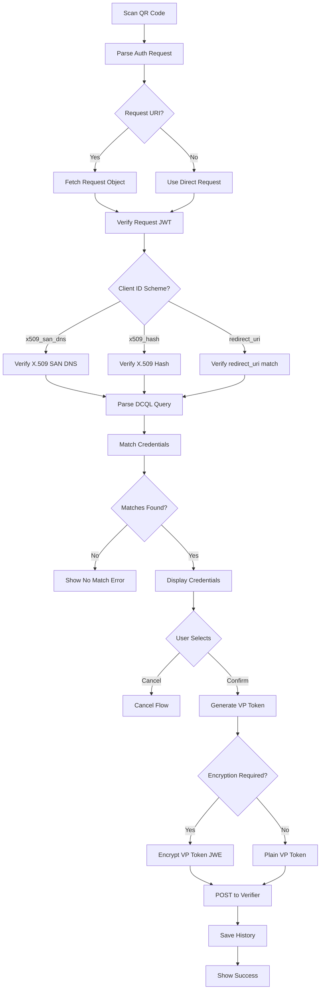

# Credential Presentation - Design

## UI/UX Design

### Screens

1. **SharingRequest** (`Feature/ShareCredential/Views/SharingRequest.swift`)
   - メインのリクエスト画面
   - Verifier情報の表示 (`RecipientOrgInfo`)
   - 要求される情報の概要 (`ProvideAge`, `ProvideID`)
   - クレデンシャル選択（Bottom Sheet）
   - 選択後のクレーム表示（提供項目/非提供項目）
   - Cancel / Provide Informationボタン

2. **CredentialPickerSheet** (`Feature/ShareCredential/Views/SharingRequest.swift`内)
   - Bottom Sheet UIでのクレデンシャル選択
   - `.presentationDetents([.medium, .large])`で高さ制御
   - DCQLクエリにマッチしたクレデンシャルのリスト表示
   - タップで選択、画面遷移なし

3. **RedirectView** (`Feature/ShareCredential/Views/RedirectView.swift`)
   - VP送信成功後のリダイレクト処理
   - WebViewによるVerifierサイトへの遷移

### Credential Selection Flow

```
SharingRequest → Bottom Sheet（証明書一覧）→ 選択 → SharingRequest内でクレーム表示
```

画面遷移なしで、Bottom Sheetから証明書を選択。選択後はSharingRequest画面内で以下を表示：
- 提供するクレーム（Sharing Contents of this certificate）
- 提供しないクレーム（Not Sharing Contents of this certificate）

### selectCredential Processing Flow

`SharingRequest.selectCredential(_:)` はクレデンシャル選択時の内部処理を担当：

```
1. displayCredential を設定
       ↓
2. viewModel.classifyClaims(credential:) でクレーム分類
   - requiredClaims: 提供するクレーム
   - undisclosedClaims: 非開示クレーム
       ↓
3. viewModel.createSubmissionCredential() で SubmissionCredential 作成
   - requiredClaims を含める
       ↓
4. sharingRequestModel.setSelectedCredentials() で状態更新
       ↓
5. UI状態更新（selectedCredential, proofBy, claimsLoaded）
```

### Supporting Components

| Component | File | Description |
|-----------|------|-------------|
| RecipientOrgInfo | `Feature/ShareCredential/Views/RecipientOrgInfo.swift` | Verifier組織情報表示 |
| ProvideAge | `Feature/ShareCredential/Views/ProvideAge.swift` | 年齢確認クレデンシャル表示 |
| ProvideID | `Feature/ShareCredential/Views/ProvideID.swift` | ID確認クレデンシャル表示 |
| DisclosureRow | `Feature/Credentials/Views/DisclosureRow.swift` | 個別クレーム表示行 |
| StatusBox | - | クレデンシャル選択状態表示 |

### ViewModels

**SharingRequestViewModel** (`Feature/ShareCredential/ViewModels/SharingRequestViewModel.swift`)
- VP提示のメインロジック

> Note: VP関連ロジック（DCQLフィルタリング、クレーム分類、SubmissionCredential作成）はすべてSharingRequestViewModelに統合されています。CredentialListViewModelおよびCredentialDetailViewModelはVPフローでは使用されません。

### Models

| Model | File | Description |
|-------|------|-------------|
| SharingRequestModel | `Feature/ShareCredential/Models/SharingRequesModel.swift` | 共有リクエスト状態管理（@Observable） |
| SharingCredentialArgs | `Feature/ShareCredential/Models/SharingCredentialArgs.swift` | 画面遷移引数 |

## Data Flow


