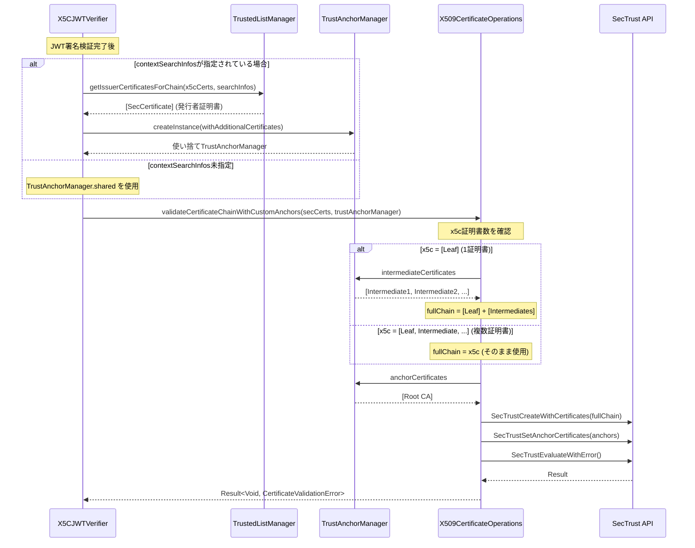

# 証明書チェーン検証

[← README](./README.md)

## 証明書チェーン検証フロー



## 検証パターン

### パターンA: TrustedListから発行者証明書を取得

```
contextSearchInfos指定あり:
  1. TrustedListManagerがx5cの末尾証明書のAKI/SKIで発行者を検索
  2. 見つかった発行者証明書で使い捨てTrustAnchorManagerを生成
  3. 生成したTrustAnchorManagerで証明書チェーンを検証

JWT x5c Header: [Leaf Certificate]
              ↓
TrustedListManager: AKI/SKI検索 → [Issuer Certificate(s)]
              ↓
TrustAnchorManager.createInstance(): 使い捨てインスタンス生成
              ↓
SecTrust: Leaf → Issuer → Root ✓
```

### パターンB: シングルトンTrustAnchorManagerを使用

```
contextSearchInfos未指定またはTrustedList検索失敗:
  TrustAnchorManager.sharedの証明書で検証

JWT x5c Header: [Leaf Certificate]
              ↓
TrustAnchorManager.shared: [Intermediate1, Intermediate2] + [Root]
              ↓
SecTrust: Leaf → Intermediate → Root ✓
```

### 複数トラストチェーンのサポート

```
TrustAnchorManager:
  anchorCertificates: [Root A, Root B]
  intermediateCertificates: [Intermediate A, Intermediate B]

Chain A: Leaf A → Intermediate A → Root A ✓
Chain B: Leaf B → Intermediate B → Root B ✓
```

---

## useCustomAnchorsOnly パラメータ

`validateCertificateChainWithCustomAnchors`メソッドの`useCustomAnchorsOnly`パラメータは、信頼するルートCAの範囲を制御します。

カスタムアンカーは**追加のアンカー**として位置付けられており、デフォルトではシステムCAと併用されます。

| 値 | 信頼するルートCA | ユースケース |
|----|-----------------|-------------|
| `false`（デフォルト） | カスタムアンカー + システムCA | 公的CAにプライベートCAを追加 |
| `true` | カスタムアンカーのみ | プライベートCA環境、閉じたエコシステム |

### useCustomAnchorsOnly: false（デフォルト）

```
信頼するルートCA: [Custom Root A, Custom Root B] + [システムCA全体]

Leaf → Intermediate → Custom Root A ✓ 検証成功
Leaf → Intermediate → DigiCert Root ✓ 検証成功（システムCAも信頼される）
```

**使用例:** システムCAに加えて、組織のプライベートCAも受け入れる場合

### useCustomAnchorsOnly: true

```
信頼するルートCA: [Custom Root A, Custom Root B]
システムCA: 信頼しない

Leaf → Intermediate → Custom Root A ✓ 検証成功
Leaf → Intermediate → DigiCert Root ✗ 検証失敗（システムCAは信頼されない）
```

**使用例:** 特定の組織が発行した証明書のみを受け入れる閉じた環境

### 内部実装

```swift
// SecTrustSetAnchorCertificatesOnly の呼び出し
SecTrustSetAnchorCertificatesOnly(trust, useCustomAnchorsOnly)
// true: カスタムアンカーのみ
// false: カスタムアンカー + システムCA
```

### フォールバック動作

カスタムアンカーが設定されていない場合（`TrustAnchorManager.hasCustomAnchors == false`）、システムCAのみで検証が行われます：

```swift
guard trustAnchorManager.hasCustomAnchors else {
    // カスタムアンカーなし → システムCAで検証
    return validateTrust(
        certificates,
        customAnchors: nil,
        useCustomAnchorsOnly: false
    )
}
```

**注意:** `validateCertificateChainWithCustomAnchors`は`Result<Void, CertificateValidationError>`を返します。throwsではありません。

---

## CertificateValidationError

証明書チェーン検証の結果は`Result<Void, CertificateValidationError>`で返されます。

```swift
enum CertificateValidationError: LocalizedError {
    case trustCreationFailed              // SecTrust作成失敗
    case anchorSettingFailed              // アンカー設定失敗
    case untrustedRoot(certificateName: String)      // 信頼されていないルートCA
    case certificateExpired(certificateName: String)  // 証明書期限切れ
    case certificateRevoked(certificateName: String)  // 証明書失効
    case certificateNotYetValid(certificateName: String)  // 証明書がまだ有効ではない
    case invalidCertificate(certificateName: String, reason: String)  // 無効な証明書
    case chainIncomplete                  // チェーン不完全
    case unknownError(description: String) // 不明なエラー
}
```

### エラーマッピング

SecTrustのOSStatusコードから`CertificateValidationError`へのマッピング：

| OSStatus | エラー |
|----------|-------|
| `-67818` (errSecCertificateExpired) | `certificateExpired` |
| `-67819` (errSecCertificateNotValidYet) | `certificateNotYetValid` |
| `-67820` (errSecCertificateRevoked) | `certificateRevoked` |
| `-67843` (errSecNotTrusted) | `untrustedRoot` |

---

## SecTrust API

SecTrustはiOS/macOSのSecurity frameworkで提供される証明書チェーン検証APIです。本実装で使用している主要なAPIを解説します。

### 主要なAPI

| API | 説明 |
|-----|------|
| `SecTrustCreateWithCertificates` | 証明書配列とポリシーからSecTrustオブジェクトを作成 |
| `SecTrustSetAnchorCertificates` | 信頼するルートCA（アンカー）を設定 |
| `SecTrustSetAnchorCertificatesOnly` | カスタムアンカーのみを使用するか制御 |
| `SecTrustEvaluateWithError` | 証明書チェーンを評価（検証実行） |
| `SecTrustGetTrustResult` | 検証結果を取得 |

### 検証フロー（内部実装）

```swift
// 1. SecTrustオブジェクトの作成
var trust: SecTrust?
let policy = SecPolicyCreateBasicX509()
SecTrustCreateWithCertificates(certificates as CFArray, policy, &trust)

// 2. カスタムアンカーの設定（オプション）
if let anchors = customAnchors {
    SecTrustSetAnchorCertificates(trust, anchors as CFArray)
    SecTrustSetAnchorCertificatesOnly(trust, useCustomAnchorsOnly)
}

// 3. 検証の実行
var error: CFError?
let success = SecTrustEvaluateWithError(trust, &error)

// 4. 結果の確認
var trustResult: SecTrustResultType = .invalid
SecTrustGetTrustResult(trust, &trustResult)
// .unspecified または .proceed なら成功
```

### SecTrustResultType

| 値 | 意味 |
|----|------|
| `.unspecified` | 暗黙的に信頼（ユーザー設定なし、システムCAで検証成功） |
| `.proceed` | 明示的に信頼（ユーザーが信頼を承認） |
| `.deny` | 明示的に拒否 |
| `.recoverableTrustFailure` | 回復可能な失敗（期限切れ等） |
| `.fatalTrustFailure` | 致命的な失敗 |
| `.invalid` | 無効な状態 |

### ポリシー

| ポリシー | 説明 | 用途 |
|---------|------|------|
| `SecPolicyCreateBasicX509()` | 基本的なX.509検証 | 証明書チェーンのみ検証（本実装で使用） |
| `SecPolicyCreateSSL(true, hostname)` | SSL/TLS検証 | ホスト名検証を含む |
| `SecPolicyCreateRevocation(...)` | 失効チェック | OCSP/CRL検証 |

### チェーン構築の自動化

SecTrustは証明書チェーンを**自動的に構築**します：

```
入力: [Leaf, Intermediate1, Intermediate2, Root]
      ※順序は不問

SecTrust内部:
1. 各証明書のIssuer/Subjectを解析
2. Leaf → Intermediate → Root の順序を自動決定
3. アンカー（ルートCA）に到達できるか検証
```

これにより、中間証明書の順序を気にせずに渡すことができます。

---

## デバッグログ

`validateCertificateChainWithCustomAnchors`は検証プロセスを詳細にログ出力します：

```
🔐 [CertValidation] ========== Certificate Chain Validation ==========
🔐 [CertValidation] Input certificates: 1
🔐 [CertValidation]   [0] example.com
🔐 [CertValidation] Custom anchors available: true
🔐 [CertValidation]   Anchors: 1
🔐 [CertValidation]   Intermediates: 1
🔐 [CertValidation] Added 1 intermediate(s) to chain
🔐 [CertValidation] Validating with custom anchors...
🔐 [CertValidation] ✅ Certificate chain validation PASSED
🔐 [CertValidation] =================================================
```

### ログプレフィックス

| プレフィックス | 意味 |
|--------------|------|
| `🔐 [CertValidation]` | 証明書チェーン検証 |
| `🔐 [X509]` | AKI/SKI抽出、発行者検索 |

---

## 参考リンク

- [Apple Developer: Certificate, Key, and Trust Services](https://developer.apple.com/documentation/security/certificate_key_and_trust_services)
- [SecTrust Reference](https://developer.apple.com/documentation/security/sectrust)
