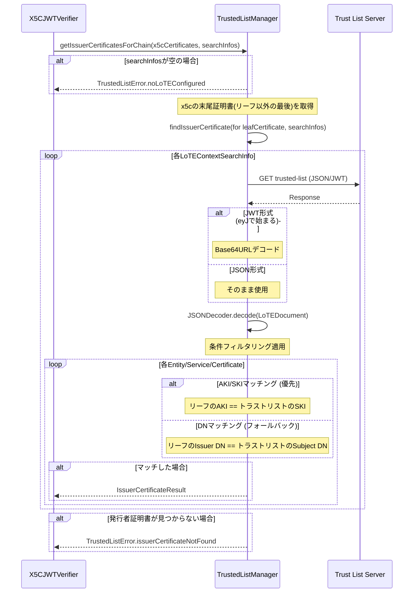

# トラストリスト

[← README](./README.md)

## Certificate-Based Search

### 概要

トラストリストからの証明書検索は、サービスURL（ServiceSupplyPoints）ではなく、証明書の識別子に基づいて行われます。

### 検索アルゴリズム

1. **AKI/SKIマッチング（優先）**
   - リーフ証明書のAuthority Key Identifier (AKI) を取得
   - トラストリスト内の各証明書のSubject Key Identifier (SKI) と比較
   - マッチした証明書を発行者証明書として返却

2. **DNマッチング（フォールバック）**
   - AKI/SKIが利用できない場合に使用
   - リーフ証明書のIssuer Distinguished Name (DN) を取得
   - トラストリスト内の各証明書のSubject DN と比較
   - マッチした証明書を発行者証明書として返却

### 条件フィルタリング

検索時に以下の条件でフィルタリングが可能:

- `loteType`: LoTEの種類 (例: private, public)
- `serviceTypeIdentifier`: サービスタイプ (例: CredentialIssuance)
- `status`: サービスステータス (例: granted, withdrawn)

### TrustedListManager内部処理フロー



---

## LoTE Data Models

### LoTE Document Structure (ETSI TS 119 602)

```json
{
  "LoTE": {
    "ListAndSchemeInformation": {
      "SchemeOperatorName": [{ "lang": "en", "value": "Operator Name" }],
      "ListIssueDateTime": "2026-01-01T00:00:00Z",
      "NextUpdate": "2026-06-01T00:00:00Z"
    },
    "TrustedEntitiesList": [
      {
        "TrustedEntityInformation": {
          "TEName": [{ "lang": "en", "value": "Entity Name" }]
        },
        "TrustedEntityServices": [
          {
            "ServiceInformation": {
              "ServiceTypeIdentifier": "http://example.com/SvcType/CredentialIssuance",
              "ServiceStatus": "http://uri.etsi.org/TrstSvc/TrustedList/Svcstatus/granted",
              "ServiceSupplyPoints": [
                { "uriValue": "https://issuer.example.com" }
              ],
              "ServiceDigitalIdentity": {
                "X509Certificates": ["-----BEGIN CERTIFICATE-----\n...\n-----END CERTIFICATE-----"]
              }
            }
          }
        ]
      }
    ]
  }
}
```

### LoTEContextSearchInfo

VCIMetadataClient等に渡すLoTEコンテキスト検索情報。

```swift
struct LoTEContextSearchInfo {
    let url: URL
    let contextName: String
    let condition: SearchCondition

    struct SearchCondition {
        let loteType: String?
        let serviceTypeIdentifier: String?
        let status: String?  // nil = フィルタリングなし
    }
}
```
