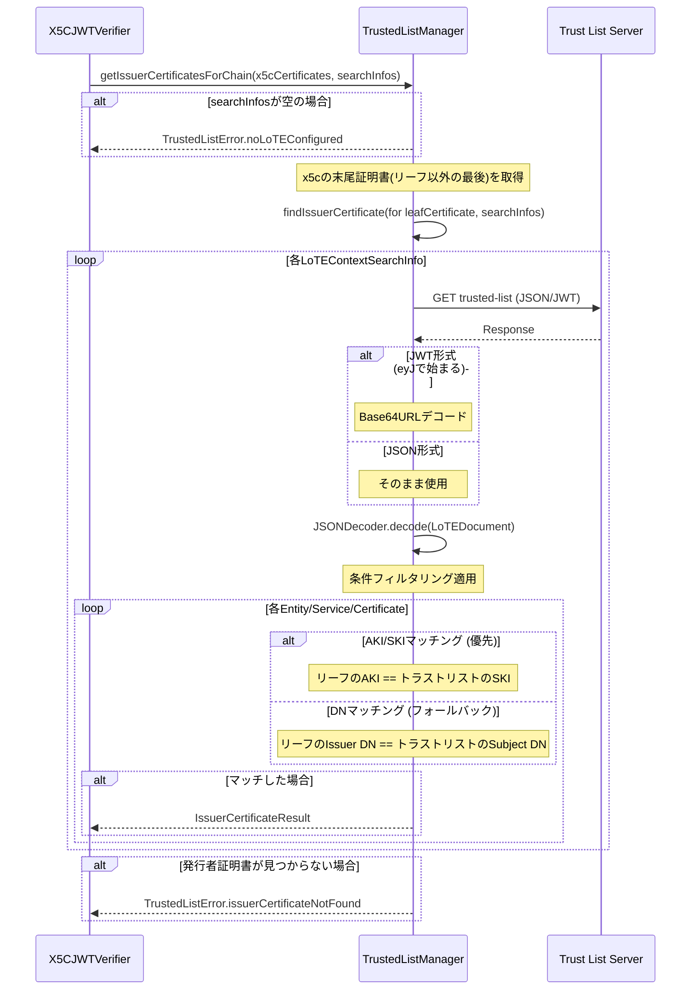
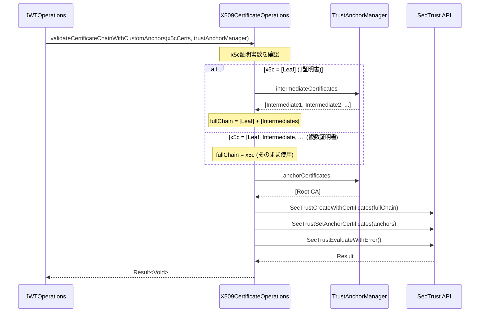

# X.509証明書チェーン検証機能

## 概要

X.509証明書チェーン検証とトラストリスト（ETSI TS 119 602 LoTE形式）管理機能を提供します。

### 主な機能

| 機能 | 説明 | 仕様 |
|------|------|------|
| Certificate Chain Validation | カスタム信頼アンカーを使用した証明書チェーン検証 | RFC 5280 |
| Trust List Management | LoTE形式のトラストリスト管理と証明書検索 | ETSI TS 119 602 |
| Certificate-Based Search | AKI/SKI・DNによる証明書マッチング | RFC 5280 |

### 使用される機能

- **OID4VCI**: 署名付きメタデータの検証 → [Metadata Verification](./features/credential-issuance/metadata-verification.md)
- **OID4VP**: Request Object JWTの検証

## アーキテクチャ

```
┌─────────────────────────────────────────────────────────────────┐
│                       呼び出し元                                  │
│         (VCIMetadataClient, OpenIdProvider, etc.)                │
│                           │                                      │
│                           ▼                                      │
│                    X5CJWTVerifier                                │
│          (JWT検証 + 証明書チェーン検証統合)                        │
│                           │                                      │
│              ┌────────────┼────────────┐                         │
│              ▼            ▼            ▼                         │
│      JWTOperations  TrustedListManager  X509CertificateOps       │
│      (署名検証)     (トラストリスト検索)  (チェーン検証)            │
│                           │            │                         │
│                           ▼            ▼                         │
│                    TrustAnchorManager   SecTrust API             │
│                    (証明書管理)         (iOS検証)                 │
└─────────────────────────────────────────────────────────────────┘
```

## コンポーネント

### TrustAnchorManager

証明書の読み込みと管理を行うシングルトンクラス。

**ファイル:** `tw2023_wallet/Signature/TrustAnchorManager.swift`

#### 主な機能

| プロパティ/メソッド | 説明 |
|-------------------|------|
| `shared` | シングルトンインスタンス |
| `anchorCertificates` | ルートCA証明書の配列 |
| `intermediateCertificates` | 中間証明書の配列 |
| `hasCustomAnchors` | カスタムアンカーが設定されているか |
| `reload()` | バンドルから証明書を再読み込み |
| `clear()` | すべての証明書をクリア |

#### 証明書の自動分類

証明書は内容に基づいて自動分類されます：

```swift
// 自己署名証明書（Issuer == Subject）→ ルートCA
// それ以外 → 中間証明書
private func isSelfSignedCertificate(_ certificate: SecCertificate) -> Bool {
    let issuer = SecCertificateCopyNormalizedIssuerSequence(certificate)
    let subject = SecCertificateCopyNormalizedSubjectSequence(certificate)
    return (issuer as Data) == (subject as Data)
}
```

### X509CertificateOperations

証明書チェーン検証のコアロジックを提供。

**ファイル:** `tw2023_wallet/Signature/X509CertificateOperations.swift`

#### 証明書変換ヘルパー

証明書を`SecCertificate`に変換するためのヘルパーメソッド：

| メソッド | 入力型 | 説明 |
|---------|-------|------|
| `derDataToSecCertificates(_:)` | `[Data]` | DERデータ配列を変換 |
| `derDataToSecCertificates(_:)` | `[Data?]` | オプショナルDERデータ配列を変換（nilがあれば失敗） |
| `certificatesToSecCertificates(_:)` | `[Certificate]` | X509.Certificate配列を変換 |

```swift
// 使用例
let derCertificates: [Data] = ...
guard let secCerts = X509CertificateOperations.derDataToSecCertificates(derCertificates) else {
    // 変換失敗
    return
}
let isValid = try X509CertificateOperations.validateCertificateChainWithCustomAnchors(leafCertificates: secCerts)
```

#### 検証メソッド

すべての証明書チェーン検証は `validateCertificateChainWithCustomAnchors` に統一されています。

##### validateCertificateChainWithCustomAnchors

```swift
// TrustAnchorManagerを使用した検証（標準）
static func validateCertificateChainWithCustomAnchors(
    leafCertificates: [SecCertificate],
    useCustomAnchorsOnly: Bool = false
) throws -> Bool
```

**特徴:**
- `TrustAnchorManager.shared`から中間証明書とルートCAを自動取得
- カスタムアンカーがない場合はシステムCAにフォールバック
- `useCustomAnchorsOnly: false`（デフォルト）でシステムCAも併用

##### validateTrust (内部メソッド)

```swift
private static func validateTrust(
    _ certificates: [SecCertificate],
    customAnchors: [SecCertificate]?,
    useCustomAnchorsOnly: Bool
) throws -> Bool
```

**特徴:**
- すべてのvalidate関数から呼び出される共通実装
- SecTrust APIを直接操作
- `customAnchors`がnilの場合はシステムCAのみで検証

#### 使用パターン

```swift
// パターン1: DERデータから検証
let derCertificates: [Data?] = ...
if let secCerts = X509CertificateOperations.derDataToSecCertificates(derCertificates) {
    let isValid = try X509CertificateOperations.validateCertificateChainWithCustomAnchors(
        leafCertificates: secCerts
    )
}

// パターン2: X509.Certificateから検証
let certificates: [Certificate] = ...
if let secCerts = X509CertificateOperations.certificatesToSecCertificates(certificates) {
    let isValid = try X509CertificateOperations.validateCertificateChainWithCustomAnchors(
        leafCertificates: secCerts
    )
}
```

### TrustedListManager

ETSI TS 119 602 LoTE（List of Trusted Entities）形式のトラストリスト管理。証明書ベースの発行者検索を提供。

**ファイル:** `tw2023_wallet/Services/TrustedList/TrustedListManager.swift`

#### 主なAPI

```swift
class TrustedListManager {
    static let shared = TrustedListManager()

    /// トラストリストをフェッチ (JSON/JWT両形式対応)
    func fetchTrustedList(from url: URL) async throws -> LoTEDocument

    /// リーフ証明書の発行者証明書をトラストリストから検索
    /// AKI/SKIマッチングを優先し、フォールバックとしてDNマッチングを使用
    func findIssuerCertificate(
        for leafCertificate: Certificate,
        searchInfos: [LoTEContextSearchInfo]
    ) async throws -> IssuerCertificateResult

    /// x5c証明書チェーンの発行者証明書を取得
    /// x5cの末尾証明書の発行者をトラストリストから検索
    func getIssuerCertificatesForChain(
        x5cCertificates: [Certificate],
        searchInfos: [LoTEContextSearchInfo]
    ) async throws -> [SecCertificate]
}
```

#### 検索結果型

```swift
/// 発行者証明書検索結果
struct IssuerCertificateResult {
    let entity: TrustedEntity
    let service: TrustedEntityService
    let issuerCertificate: Certificate
    let matchMethod: MatchMethod
}

/// マッチング方法
enum MatchMethod {
    case akiSki           // AKI/SKIによるマッチング（優先）
    case distinguishedName // DNによるフォールバックマッチング
}
```

#### TrustedListError

```swift
enum TrustedListError: Error {
    case noLoTEConfigured           // LoTE情報が指定されていない
    case invalidURL(String)
    case fetchFailed(URL, Error)
    case parseError(Error)
    case issuerCertificateNotFound  // 発行者証明書が見つからない
    case noCertificatesInService
    case certificateParseError
}
```

### X5CJWTVerifier

x5c/x5uヘッダーを使用したJWT検証のラッパー層。JWTOperationsとX509CertificateOperationsを統合して証明書チェーン検証を行う。

**ファイル:** `tw2023_wallet/Signature/X5CJWTVerifier.swift`

```swift
enum X5CJWTVerifier {
    typealias VerifiedX5CJwt = (decoded: JWT, certs: [Certificate])

    /// x5cヘッダーでJWTを検証 (署名検証 + 証明書チェーン検証)
    /// 証明書ベースの検索でトラストリストから発行者証明書を取得
    static func verifyJwtWithX5C(
        jwt: String,
        contextSearchInfos: [LoTEContextSearchInfo],
        verifyCertChain: Bool = true
    ) async -> Result<VerifiedX5CJwt, JWTVerificationError>

    /// x5uヘッダーでJWTを検証
    static func verifyJwtWithX5U(
        jwt: String
    ) -> Result<JWT, JWTVerificationError>
}
```

## Certificate-Based Search

### 概要

トラストリストからの証明書検索は、サービスURL（ServiceSupplyPoints）ではなく、証明書の識別子に基づいて行われます。

### 検索アルゴリズム

1. **AKI/SKIマッチング（優先）**
   - リーフ証明書のAuthority Key Identifier (AKI) を取得
   - トラストリスト内の各証明書のSubject Key Identifier (SKI) と比較
   - マッチした証明書を発行者証明書として返却

2. **DNマッチング（フォールバック）**
   - AKI/SKIが利用できない場合に使用
   - リーフ証明書のIssuer Distinguished Name (DN) を取得
   - トラストリスト内の各証明書のSubject DN と比較
   - マッチした証明書を発行者証明書として返却

### 条件フィルタリング

検索時に以下の条件でフィルタリングが可能:

- `loteType`: LoTEの種類 (例: private, public)
- `serviceTypeIdentifier`: サービスタイプ (例: CredentialIssuance)
- `status`: サービスステータス (例: granted, withdrawn)

### TrustedListManager内部処理フロー



## LoTE Data Models

### LoTE Document Structure (ETSI TS 119 602)

```json
{
  "LoTE": {
    "ListAndSchemeInformation": {
      "SchemeOperatorName": [{ "lang": "en", "value": "Operator Name" }],
      "ListIssueDateTime": "2026-01-01T00:00:00Z",
      "NextUpdate": "2026-06-01T00:00:00Z"
    },
    "TrustedEntitiesList": [
      {
        "TrustedEntityInformation": {
          "TEName": [{ "lang": "en", "value": "Entity Name" }]
        },
        "TrustedEntityServices": [
          {
            "ServiceInformation": {
              "ServiceTypeIdentifier": "http://example.com/SvcType/CredentialIssuance",
              "ServiceStatus": "http://uri.etsi.org/TrstSvc/TrustedList/Svcstatus/granted",
              "ServiceSupplyPoints": [
                { "uriValue": "https://issuer.example.com" }
              ],
              "ServiceDigitalIdentity": {
                "X509Certificates": ["-----BEGIN CERTIFICATE-----\n...\n-----END CERTIFICATE-----"]
              }
            }
          }
        ]
      }
    ]
  }
}
```

### LoTEContextSearchInfo

VCIMetadataClient等に渡すLoTEコンテキスト検索情報。

```swift
struct LoTEContextSearchInfo {
    let url: URL
    let contextName: String
    let condition: SearchCondition

    struct SearchCondition {
        let loteType: String?
        let serviceTypeIdentifier: String?
        let status: String?  // nil = フィルタリングなし
    }
}
```

## 証明書チェーン検証フロー



## セットアップ

### 1. 証明書ファイルの配置

証明書ファイル（`.cer`, `.pem`, `.crt`）を `Certificates/` ディレクトリに配置：

```
Certificates/
├── root.cer           # ルートCA（自己署名）
├── intermediate1.cer  # 中間証明書1
└── intermediate2.cer  # 中間証明書2
```

### 2. Xcode Build Phaseの設定

証明書をアプリバンドルにコピーするRun Scriptを追加：

1. **TARGETS** → `tw2023_wallet` → **Build Phases**
2. **+** → **New Run Script Phase**
3. **Copy Bundle Resources**の前に配置
4. 以下のスクリプトを設定：

```bash
CERT_SOURCE="${SRCROOT}/Certificates"
CERT_DEST="${BUILT_PRODUCTS_DIR}/${UNLOCALIZED_RESOURCES_FOLDER_PATH}/Certificates"

mkdir -p "$CERT_DEST"

if [ -d "$CERT_SOURCE" ]; then
    cp "$CERT_SOURCE"/*.cer "$CERT_DEST/" 2>/dev/null || true
    echo "Certificates copied"
fi
```

5. **Build Settings** → **User Script Sandboxing** → **No**

### 3. 証明書のGit除外

証明書ファイルはコミットしない場合、`.gitignore`に追加：

```gitignore
Certificates/*.cer
Certificates/*.pem
Certificates/*.crt
```

## useCustomAnchorsOnly パラメータ

`validateCertificateChainWithCustomAnchors`メソッドの`useCustomAnchorsOnly`パラメータは、信頼するルートCAの範囲を制御します。

カスタムアンカーは**追加のアンカー**として位置付けられており、デフォルトではシステムCAと併用されます。

| 値 | 信頼するルートCA | ユースケース |
|----|-----------------|-------------|
| `false`（デフォルト） | カスタムアンカー + システムCA | 公的CAにプライベートCAを追加 |
| `true` | カスタムアンカーのみ | プライベートCA環境、閉じたエコシステム |

### useCustomAnchorsOnly: false（デフォルト）

```
信頼するルートCA: [Custom Root A, Custom Root B] + [システムCA全体]

Leaf → Intermediate → Custom Root A ✓ 検証成功
Leaf → Intermediate → DigiCert Root ✓ 検証成功（システムCAも信頼される）
```

**使用例:** システムCAに加えて、組織のプライベートCAも受け入れる場合

### useCustomAnchorsOnly: true

```
信頼するルートCA: [Custom Root A, Custom Root B]
システムCA: 信頼しない

Leaf → Intermediate → Custom Root A ✓ 検証成功
Leaf → Intermediate → DigiCert Root ✗ 検証失敗（システムCAは信頼されない）
```

**使用例:** 特定の組織が発行した証明書のみを受け入れる閉じた環境

### 内部実装

```swift
// SecTrustSetAnchorCertificatesOnly の呼び出し
SecTrustSetAnchorCertificatesOnly(trust, useCustomAnchorsOnly)
// true: カスタムアンカーのみ
// false: カスタムアンカー + システムCA
```

### フォールバック動作

カスタムアンカーが設定されていない場合（`TrustAnchorManager.hasCustomAnchors == false`）、システムCAのみで検証が行われます：

```swift
guard manager.hasCustomAnchors else {
    // カスタムアンカーなし → システムCAで検証
    return try validateTrust(leafCertificates, customAnchors: nil, useCustomAnchorsOnly: false)
}
```

## SecTrust API

SecTrustはiOS/macOSのSecurity frameworkで提供される証明書チェーン検証APIです。本実装で使用している主要なAPIを解説します。

### 主要なAPI

| API | 説明 |
|-----|------|
| `SecTrustCreateWithCertificates` | 証明書配列とポリシーからSecTrustオブジェクトを作成 |
| `SecTrustSetAnchorCertificates` | 信頼するルートCA（アンカー）を設定 |
| `SecTrustSetAnchorCertificatesOnly` | カスタムアンカーのみを使用するか制御 |
| `SecTrustEvaluateWithError` | 証明書チェーンを評価（検証実行） |
| `SecTrustGetTrustResult` | 検証結果を取得 |

### 検証フロー（内部実装）

```swift
// 1. SecTrustオブジェクトの作成
var trust: SecTrust?
let policy = SecPolicyCreateBasicX509()
SecTrustCreateWithCertificates(certificates as CFArray, policy, &trust)

// 2. カスタムアンカーの設定（オプション）
if let anchors = customAnchors {
    SecTrustSetAnchorCertificates(trust, anchors as CFArray)
    SecTrustSetAnchorCertificatesOnly(trust, useCustomAnchorsOnly)
}

// 3. 検証の実行
var error: CFError?
let success = SecTrustEvaluateWithError(trust, &error)

// 4. 結果の確認
var trustResult: SecTrustResultType = .invalid
SecTrustGetTrustResult(trust, &trustResult)
// .unspecified または .proceed なら成功
```

### SecTrustResultType

| 値 | 意味 |
|----|------|
| `.unspecified` | 暗黙的に信頼（ユーザー設定なし、システムCAで検証成功） |
| `.proceed` | 明示的に信頼（ユーザーが信頼を承認） |
| `.deny` | 明示的に拒否 |
| `.recoverableTrustFailure` | 回復可能な失敗（期限切れ等） |
| `.fatalTrustFailure` | 致命的な失敗 |
| `.invalid` | 無効な状態 |

### ポリシー

| ポリシー | 説明 | 用途 |
|---------|------|------|
| `SecPolicyCreateBasicX509()` | 基本的なX.509検証 | 証明書チェーンのみ検証（本実装で使用） |
| `SecPolicyCreateSSL(true, hostname)` | SSL/TLS検証 | ホスト名検証を含む |
| `SecPolicyCreateRevocation(...)` | 失効チェック | OCSP/CRL検証 |

### チェーン構築の自動化

SecTrustは証明書チェーンを**自動的に構築**します：

```
入力: [Leaf, Intermediate1, Intermediate2, Root]
      ※順序は不問

SecTrust内部:
1. 各証明書のIssuer/Subjectを解析
2. Leaf → Intermediate → Root の順序を自動決定
3. アンカー（ルートCA）に到達できるか検証
```

これにより、中間証明書の順序を気にせずに渡すことができます。

### 参考リンク

- [Apple Developer: Certificate, Key, and Trust Services](https://developer.apple.com/documentation/security/certificate_key_and_trust_services)
- [SecTrust Reference](https://developer.apple.com/documentation/security/sectrust)

## 検証フロー

### パターンA: x5cにリーフのみ（推奨）

```
JWT x5c Header: [Leaf Certificate]
              ↓
TrustAnchorManager: [Intermediate1, Intermediate2] + [Root]
              ↓
SecTrust: Leaf → Intermediate → Root ✓
```

### 複数トラストチェーンのサポート

```
TrustAnchorManager:
  anchorCertificates: [Root A, Root B]
  intermediateCertificates: [Intermediate A, Intermediate B]

Chain A: Leaf A → Intermediate A → Root A ✓
Chain B: Leaf B → Intermediate B → Root B ✓
```

## 起動時ログ

アプリ起動時に以下のログが出力されます：

```
TrustAnchorManager: ========== Loading certificates ==========
TrustAnchorManager: Resource path: /path/to/app
TrustAnchorManager: Certificates path: /path/to/app/Certificates
TrustAnchorManager: Certificates directory exists
TrustAnchorManager: Found 3 file(s) in directory
TrustAnchorManager: Found 3 certificate file(s): ["root.cer", "intermediate1.cer", "intermediate2.cer"]
TrustAnchorManager: --- Processing: root.cer ---
TrustAnchorManager:   File size: 2020 bytes
TrustAnchorManager:   Subject: Example Root CA
TrustAnchorManager:   Type: ROOT CA (self-signed)
TrustAnchorManager: --- Processing: intermediate1.cer ---
TrustAnchorManager:   File size: 2484 bytes
TrustAnchorManager:   Subject: Example Intermediate CA 1
TrustAnchorManager:   Type: INTERMEDIATE
TrustAnchorManager: ========== Summary ==========
TrustAnchorManager: Root CAs (anchors): 1
TrustAnchorManager:   [0] Example Root CA
TrustAnchorManager: Intermediates: 2
TrustAnchorManager:   [0] Example Intermediate CA 1
TrustAnchorManager:   [1] Example Intermediate CA 2
TrustAnchorManager: ==============================
```

## テスト

### テストファイル

| ファイル | 内容 |
|---------|------|
| `TrustAnchorManagerTests.swift` | TrustAnchorManagerの単体テスト |
| `X509ChainValidationTests.swift` | 証明書チェーン検証の統合テスト |

### 主なテストケース

#### TrustAnchorManagerTests

- `testSharedInstance` - シングルトンの確認
- `testAddAnchorCertificate` - ルートCA追加
- `testAddIntermediateCertificate` - 中間証明書追加
- `testSelfSignedCertificateDetection` - 自己署名検出
- `testNonSelfSignedCertificateDetection` - 非自己署名検出

#### X509ChainValidationTests

- `testValidCertificateChainWithCustomAnchors` - 単一チェーンの検証
- `testValidCertificateChainWithTwoTrustChains` - 複数チェーンの検証
- `testInvalidChainWithMissingIntermediate` - 中間証明書欠落時の検証失敗
- `testInvalidChainWithUnknownRoot` - 未知のルートCAでの検証失敗
- `testJwtWithX5CHeaderValidation` - JWT x5cヘッダーの検証

### テスト用証明書の生成

テストでは動的に証明書チェーンを生成：

```swift
// ルートCA生成（自己署名）
let rootCert = try generateRootCACertificate(
    privateKey: rootPrivateKey,
    commonName: "Test Root CA"
)

// 中間CA生成
let intermediateCert = try generateIntermediateCACertificate(
    subjectPrivateKey: intermediatePrivateKey,
    issuerPrivateKey: rootPrivateKey,
    issuerCertificate: rootCert,
    commonName: "Test Intermediate CA"
)

// リーフ証明書生成
let leafCert = try generateLeafCertificate(
    subjectPrivateKey: leafPrivateKey,
    issuerPrivateKey: intermediatePrivateKey,
    issuerCertificate: intermediateCert,
    commonName: "test.example.com"
)
```

### 証明書有効期間の注意点

テスト証明書は `notValidBefore` を現在時刻の1時間前に設定：

```swift
let notBefore = Date().addingTimeInterval(-60 * 60)  // 1時間前
let notAfter = Date().addingTimeInterval(60 * 60 * 24 * 365)  // 1年後
```

これにより、タイミングによる「証明書が一時的に無効」エラーを回避します。

## トラブルシューティング

### 証明書が読み込まれない

1. Run Scriptが実行されているか確認（ビルドログ）
2. `User Script Sandboxing`が`No`になっているか確認
3. 証明書ファイルの形式（DER/PEM）を確認

### チェーン検証が失敗する

1. 起動時ログで証明書の読み込み状況を確認
2. 中間証明書が正しく登録されているか確認
3. 証明書の有効期限を確認

### テストが不安定

1. `notValidBefore`の設定を確認
2. テスト間の状態クリア（`setUp`/`tearDown`）を確認

## 関連ファイル

### 証明書検証

| ファイル | 説明 |
|---------|------|
| `tw2023_wallet/Signature/TrustAnchorManager.swift` | 信頼アンカー証明書管理 |
| `tw2023_wallet/Signature/X509CertificateOperations.swift` | 証明書チェーン検証 |
| `tw2023_wallet/Signature/X5CJWTVerifier.swift` | x5c/x5u JWT検証ラッパー |
| `tw2023_wallet/Signature/JWT.swift` | JWT操作 |
| `tw2023_wallet/Resources/Certificates/.gitkeep` | 証明書ディレクトリ |

### トラストリスト

| ファイル | 説明 |
|---------|------|
| `tw2023_wallet/Services/TrustedList/TrustedListManager.swift` | トラストリスト管理 |
| `tw2023_wallet/Services/TrustedList/TrustedListModels.swift` | LoTEデータモデル |
| `tw2023_wallet/Services/TrustedList/TrustedListConfig.swift` | LoTE設定モデル・ローダー |
| `TrustedListConfig.json` | LoTE設定ファイル |

### 呼び出し元

| ファイル | 説明 |
|---------|------|
| `tw2023_wallet/Services/OID/VCI/VCIMetadataClient.swift` | メタデータ取得クライアント |
| `tw2023_wallet/Services/OID/Provider/OpenIdProvider.swift` | OID4VP処理 |

## References

### Specifications

- [RFC 5280 - X.509 PKI Certificate](https://www.rfc-editor.org/rfc/rfc5280.html)
- [ETSI TS 119 602 - Trusted Lists](https://www.etsi.org/deliver/etsi_ts/119600_119699/119602/01.01.01_60/ts_119602v010101p.pdf)
- [Apple Developer: Certificate, Key, and Trust Services](https://developer.apple.com/documentation/security/certificate_key_and_trust_services)
- [SecTrust Reference](https://developer.apple.com/documentation/security/sectrust)

### Related Documentation

- [Metadata Verification](./features/credential-issuance/metadata-verification.md) - 発行時のメタデータ検証
